---
puppeteer:
    pdf:
        format: A4
        displayHeaderFooter: true
        landscape: false
        scale: 0.8
        margin:
            top: 1.2cm
            right: 1cm
            bottom: 1cm
            left: 1cm
    image:
        quality: 100
        fullPage: false
---

OpenDID IssuerAdmin Operation Guide
==

- Date: 2025-05-29
- Version: v2.0.0

Revision History
==
| Version | Date       | Changes                    |
| ------ | ---------- | -------------------------- |
| v1.0.0 | 2025-03-31 | Initial version                  |
| v1.0.1 | 2025-04-25 | Added `3.1. Issuer Registration` chapter <br> Modified `3.5. Issued VC Management` chapter |
| v2.0.0 | 2025-05-29 |  Added `3.4. ZKP Management` chapter |

Table of Contents
==

- [1. Introduction](#1-introduction)
  - [1.1. Overview](#11-overview)
  - [1.2. Admin Console Definition](#12-admin-console-definition)
- [2. Basic Manual](#2-basic-manual)
  - [2.1. Login](#21-login)
  - [2.2. Main Screen Configuration](#22-main-screen-configuration)
  - [2.3. Menu Configuration](#23-menu-configuration)
    - [2.3.1. Issuer Unregistered State](#231-issuer-unregistered-state)
    - [2.3.3. Issuer Registered State](#233-issuer-registered-state)
  - [2.4. Password Change Management](#24-password-change-management)
- [3. Function-specific Detailed Manual](#3-function-specific-detailed-manual)
  - [3.1. Issuer Registration](#31-issuer-registration)
    - [▸ Step 1 – Enter Issuer Info](#-step-1--enter-issuer-info)
    - [▸ Step 2 – Register DID Document](#-step-2--register-did-document)
    - [▸ Step 3 – Register Entity and Issue Certificate VC](#-step-3--register-entity-and-issue-certificate-vc)
    - [▸ Registration Completion Screen](#-registration-completion-screen)
  - [3.2. Issuer Management](#32-issuer-management)
    - [▸ Issuer Management](#-issuer-management)
  - [3.3. VC Management](#33-vc-management)
  - [3.3.1. Namespace Management](#331-namespace-management)
    - [▸ Namespace List](#-namespace-list)
    - [▸ Namespace Registration](#-namespace-registration)
    - [▸ Namespace Detailed Information](#-namespace-detailed-information)
    - [▸ Namespace Update](#-namespace-update)
  - [3.3.2. VC Schema Management](#332-vc-schema-management)
    - [▸ VC Schema List](#-vc-schema-list)
    - [▸ VC Schema Registration](#-vc-schema-registration)
    - [▸ VC Schema Detailed Information](#-vc-schema-detailed-information)
    - [▸ VC Schema Update](#-vc-schema-update)
  - [3.3.3. Issue Profile Management](#333-issue-profile-management)
    - [▸ Issue Profile List](#-issue-profile-list)
    - [▸ Issue Profile Registration](#-issue-profile-registration)
    - [▸ Issue Profile Detailed Information](#-issue-profile-detailed-information)
    - [▸ Issue Profile Update](#-issue-profile-update)
  - [3.4. ZKP Management](#34-zkp-management)
  - [3.4.1. ZKP Namespace Management](#341-zkp-namespace-management)
    - [▸ Namespace List](#-namespace-list-1)
    - [▸ Namespace Registration](#-namespace-registration-1)
    - [▸ Namespace Detailed Information](#-namespace-detailed-information-1)
    - [▸ Namespace Update](#-namespace-update-1)
  - [3.4.2. Credential Schema Management](#342-credential-schema-management)
    - [▸ Credential Schema List](#-credential-schema-list)
    - [▸ Credential Schema Registration](#-credential-schema-registration)
    - [▸ Credential Schema Detailed Information](#-credential-schema-detailed-information)
  - [3.4.3. Credential Definition Management](#343-credential-definition-management)
    - [▸ Credential Definition List](#-credential-definition-list)
    - [▸ Credential Definition Registration](#-credential-definition-registration)
    - [▸ Credential Definition Detailed Information](#-credential-definition-detailed-information)
  - [3.5. User Management](#35-user-management)
    - [▸ User List](#-user-list)
    - [▸ User Registration (Register)](#-user-registration-register)
    - [▸ User Detailed Information](#-user-detailed-information)
    - [▸ User Information Update](#-user-information-update)
  - [3.6. Issued VC Management](#36-issued-vc-management)
    - [▸ VC List](#-vc-list)
    - [▸ VC Status Change](#-vc-status-change)
    - [▸ VC Detailed Information](#-vc-detailed-information)
  - [3.7. Admin Management](#37-admin-management)
    - [3.7.1 Admin List Inquiry](#371-admin-list-inquiry)
    - [3.7.2. Admin Registration](#372-admin-registration)

---

# 1. Introduction

## 1.1. Overview

This document provides guidance on the installation and operation of the Open DID Issuer Admin Console.
It is structured to help users efficiently utilize the console through step-by-step explanations from basic usage to detailed manuals for each function.

For a complete installation guide for OpenDID, please refer to the [Open DID Installation Guide].

## 1.2. Admin Console Definition

**Issuer Admin Console** is a web-based administrative tool for managing **Issuer servers** within the Open DID system.

The Issuer serves as the issuing entity for Verifiable Credentials (VCs), providing management functions for namespaces, schemas, and issuance policies (profiles) related to VC issuance.

The main items that can be configured in the Issuer Admin Console are as follows:

- **Issuer Basic Information Management**
 - Issuer server registration and status verification
- **VC Issuance Item Management**
 - Namespace registration and item configuration
 - VC Schema registration and management
 - Issuance policy (Profile) configuration
- **User and VC History Management**
 - Management of users eligible for issuance
 - Verification and status tracking of issued VC lists

# 2. Basic Manual

This chapter provides guidance on the basic usage of the Open DID Issuer Admin Console.

## 2.1. Login

To access the Issuer Admin Console, follow these steps:

1. Open a web browser and access the Issuer Admin Console URL.

  ```
  http://<issuer_domain>:<port>
  ```

2. On the login screen, enter the administrator account email and password.
  - Default administrator account: <admin@opendid.omnione.net>
  - Initial password: password (must be changed upon first login)

3. Click the 'Login' button.

> **Note:**  
> For security reasons, a password change is required upon first login.

<br/>


## 2.2. Main Screen Configuration

The main screen displayed after login consists of the following elements:

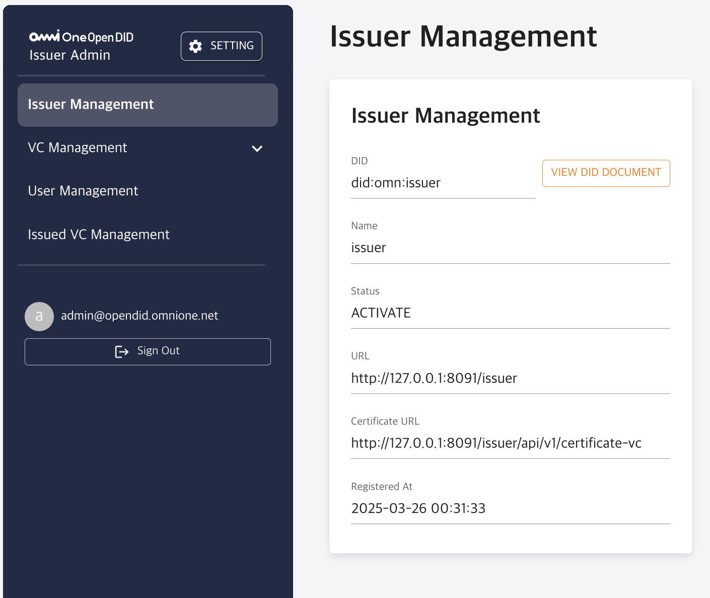

| Number | Area             | Description                                                                                                                                |
| ---- | ---------------- | ----------------------------------------------------------------------------------------------------------------------------------- |
| 1    | Header Area        | You can navigate to the password change screen through the `SETTING` button in the upper right corner.                                                        |
| 2    | Content Area      | The title of the currently selected menu and its corresponding content are displayed. The screen content changes according to each menu.                                            |
| 3    | Side Menu      | Located on the left side of the screen, with main menu items arranged vertically. The selected menu is highlighted, and sub-menus expand when necessary. |
| 4    | User Information Area | The email address of the currently logged-in administrator and the 'Sign Out' button are displayed.                                                        |


<br/>

## 2.3. Menu Configuration

The sidebar menu of the Issuer Admin Console **differs in screen configuration depending on the Issuer registration status**.


<br/>

### 2.3.1. Issuer Unregistered State

In the initial state where the Issuer server has not yet been registered,
only the Issuer Registration item is displayed alone in the menu.

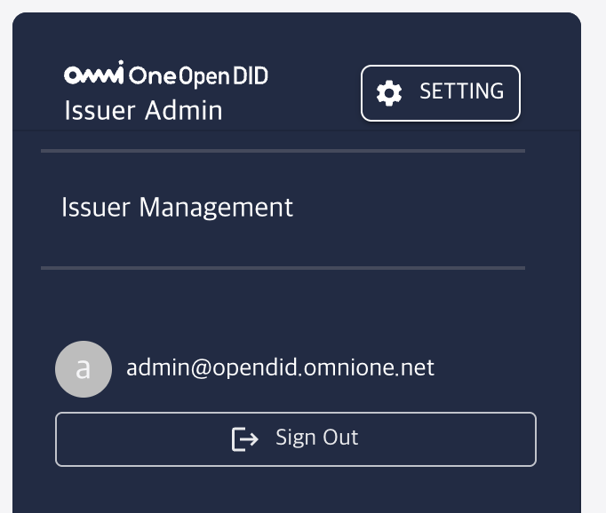

> Note: Once Issuer registration is completed, related functions are activated and the full menu expands.
Details about the menu configuration after registration will be explained in subsequent sections.

### 2.3.3. Issuer Registered State

Once Issuer registration is completed, all management functions are activated, and the sidebar menu is configured as follows:

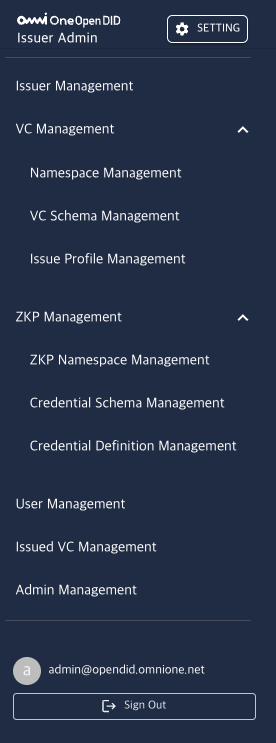

| Number | Menu Name | Depth | Description |
|------|-----------|--------|------|
| 1 | **Issuer Management** | 1 | Menu to verify and manage basic information (DID, status, etc.) of the Issuer server. |
| 2 | **VC Management** | 1 | Top-level menu where you can configure items related to VC issuance. |
| 3 | └ Namespace Management | 2 | Menu to register and manage namespaces used for VC issuance. |
| 4 | └ VC Schema Management | 2 | Menu to register and manage VC schemas to be used for VC issuance. |
| 5 | └ Issue Profile Management | 2 | Menu to manage profile information required for VC issuance. |
| 6 | **ZKP Management** | 1 | Top-level menu where you can configure items related to ZKP issuance. |
| 7 | └ ZKP Namespace Management | 2 | Menu to register and manage namespaces used in Credential Schema. |
| 8 | └ Credential Schema Management | 2 | Menu to register and manage Credential schemas to be used in Credential Definition. |
| 9 | └ Credential Definition Management | 2 | Menu to register and manage Credential Definitions to be used for Definition issuance. |
| 10 | **User Management** | 1 | Menu to manage user information for VC recipients. |
| 11 | **Issued VC Management** | 1 | Menu to verify and manage the list of issued VCs. |

> **Note:**  
> Detailed usage instructions for each function in the above menu configuration are  
> explained in numerical order in [Chapter 3. Function-specific Detailed Manual](#3-function-specific-detailed-manual).
<br/>

## 2.4. Password Change Management

User password changes can be performed through the following steps:

1. Click the 'SETTING' button in the header area.
2. Select 'Change Password' from the settings menu.
3. On the password change screen:
  - Enter current password
  - Enter new password
  - Re-enter new password for confirmation
4. Click the 'Save' button to apply the changes.

> **Note**: The password must be 8-64 characters long and include uppercase/lowercase letters, numbers, and special characters.

<br/>

# 3. Function-specific Detailed Manual

This chapter provides detailed usage instructions for the main functions of the Issuer Admin Console.

## 3.1. Issuer Registration

Issuer Registration is the procedure for registering an Issuer as the issuing entity through the Issuer Admin Console. The complete registration consists of 3 steps, with input, request, and approval processes for each step to complete registration.
Once all steps are completed, the Issuer is officially registered in the OpenDID network.

<br/>

###  ▸ Step 1 – Enter Issuer Info

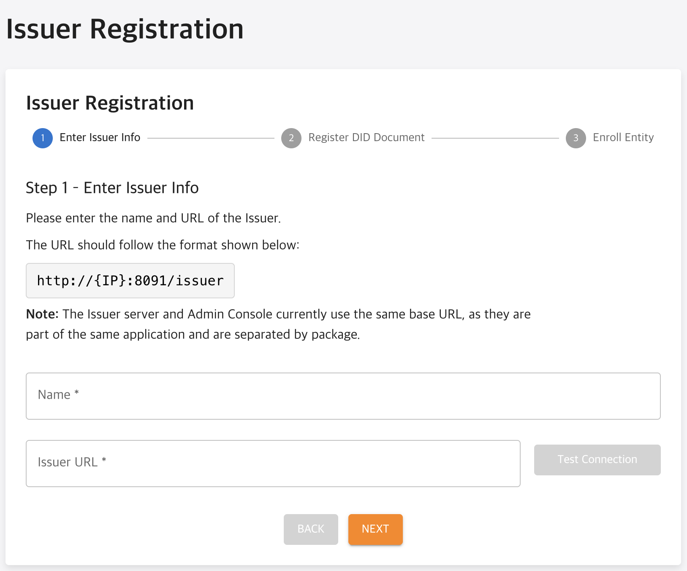

This is the step to enter the Issuer's name and server URL.

- **Name**: Name of the Issuer to register  
- **Issuer URL**: Server endpoint in the format `http://{IP}:8091/issuer`  

> **Note**  
> The Issuer server and Admin Console use the same Base URL and are separated as packages within the same application.

- After entering all items, click the **NEXT** button to move to the next step.

<br/>

### ▸ Step 2 – Register DID Document

This is the step to create the Issuer's DID Document and receive registration request and approval from TAS (Trust Agent Service). Follow the order below:

<br/>

**1. Generate DID Document**  
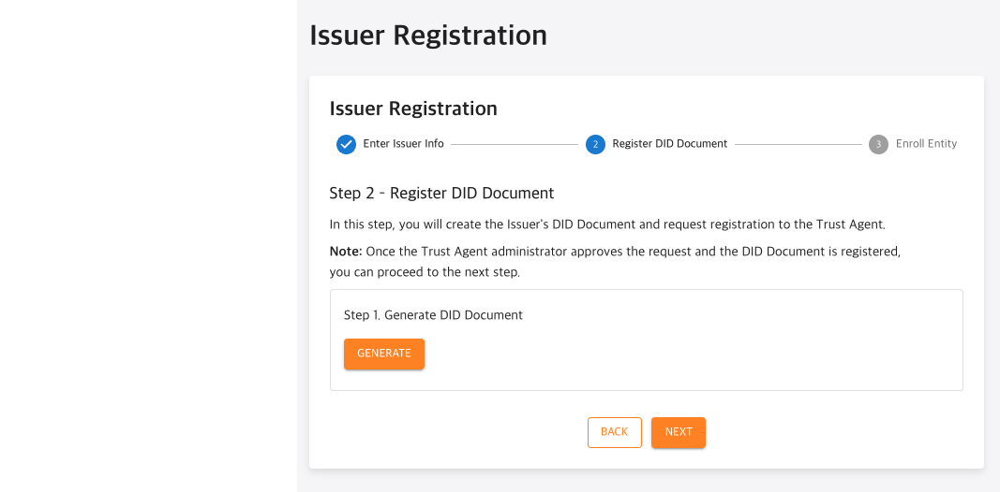  
Clicking the `GENERATE` button automatically creates a DID document and displays it in JSON format on the screen.  
> Completion message: ✅ DID Document has been successfully created.

<br/>

**2. Submit Registration Request**  
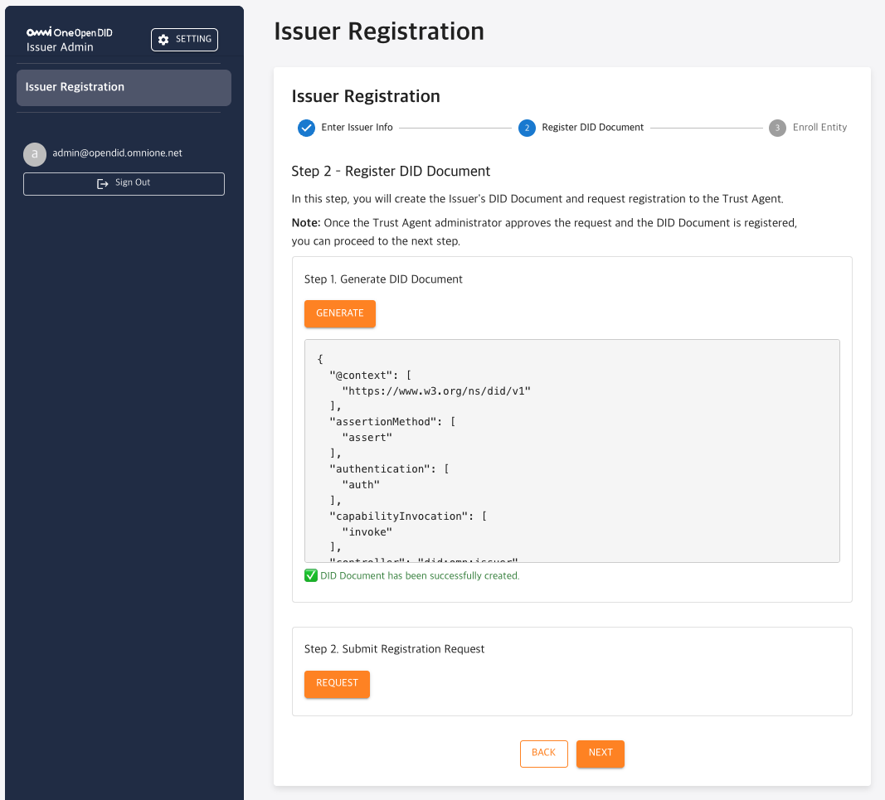  
Clicking the `REQUEST` button sends a DID document registration request to TAS.  
> Request completion message: ✅ Registration request has been submitted.

<br/>

**3. Check Approval Status**  
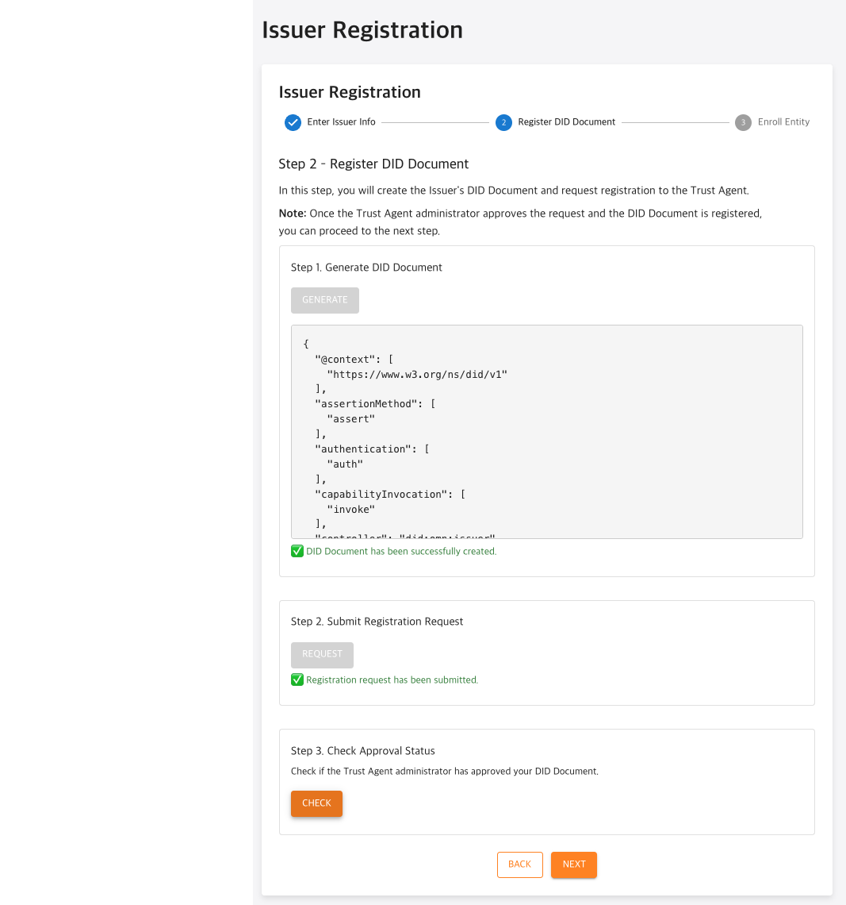  
Click the `CHECK` button to verify approval from the TAS administrator.  
> Approval completion message: ✅ Approval confirmed. You can proceed.

<br/>

**4. Screen after completing all processes**  
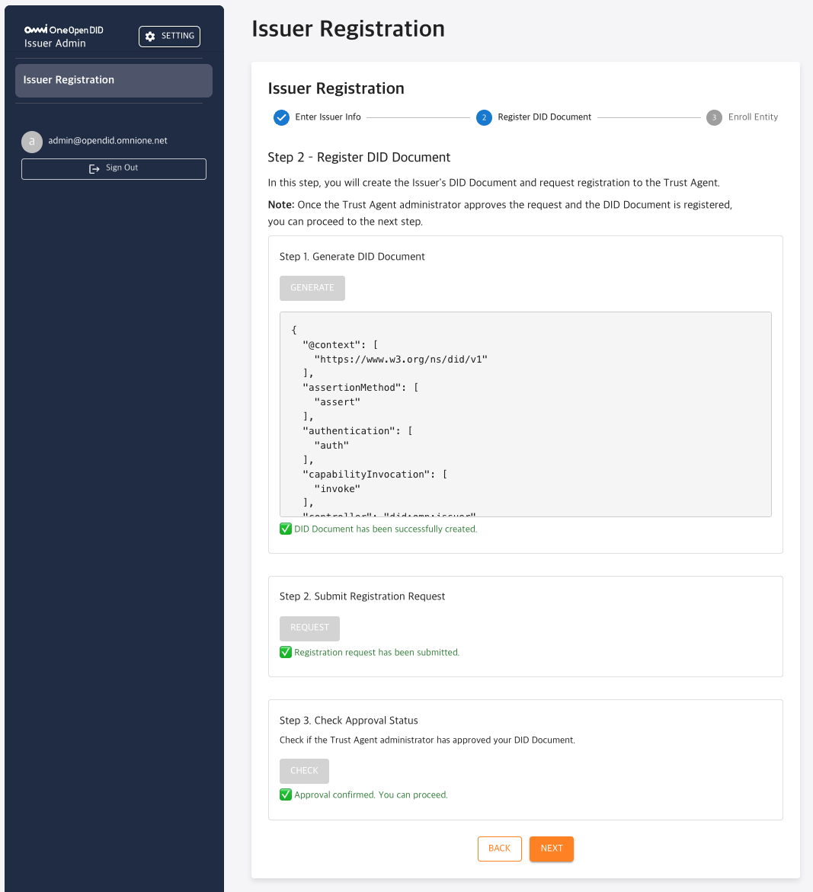

<br/>

### ▸ Step 3 – Register Entity and Issue Certificate VC

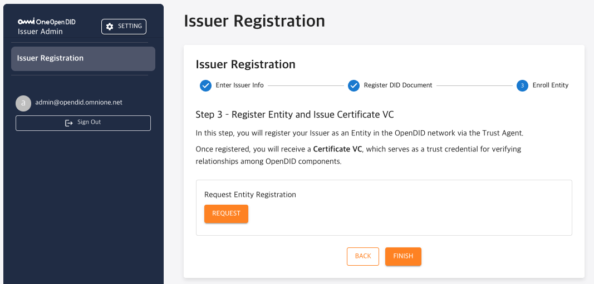

This is the final step to register the Issuer as an entity in the OpenDID network and receive a **Certificate VC (trust verification VC)**.

- Clicking the `REQUEST` button registers the Entity through TAS.
- Once registration is completed, click the `FINISH` button to complete the entire registration.

> **Note**  
> Certificate VC is a credential that proves trust relationships between OpenDID components.

<br/>

### ▸ Registration Completion Screen

Once all steps are successfully completed, the completion screen is displayed as shown below.

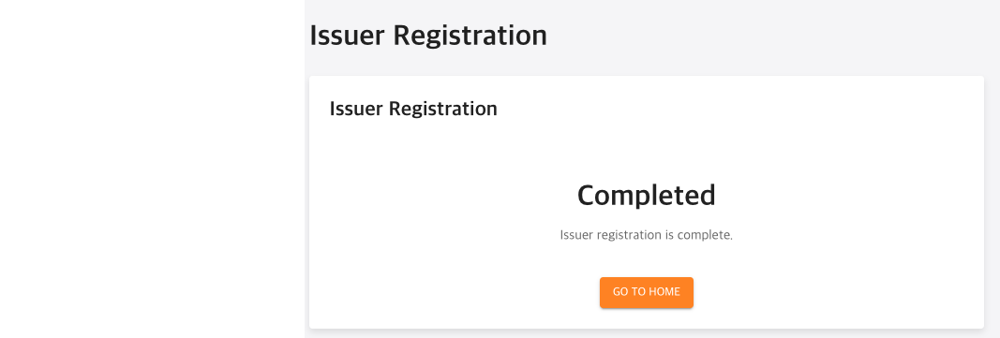

- A "Completed" message appears, and you can click the `GO TO HOME` button to navigate to the Admin Console main screen.


## 3.2. Issuer Management

Issuer Management is a menu for registering and managing basic information of the Issuer server. The Issuer must be registered with a unique DID in the system as the issuing entity for VCs (Verifiable Credentials), and registration is required only once initially.  

Once the Issuer is registered, it is displayed as active status (`ACTIVATE`) in the system, and after registration, you can view the registered information or make changes within a limited scope.

### ▸ Issuer Management

> **Note**  
> Currently, only the Quick Register method for simple registration is supported, and the formal registration procedure will be updated in June 2025.

The Issuer Management screen consists of the following items.


| Item              | Description                                                           |
|-------------------|----------------------------------------------------------------|
| **DID**           | Unique DID that identifies the Issuer, automatically issued by the system.     |
| **Name**          | Name of the Issuer to register.                                    |
| **Status**        | Indicates the status of the Issuer. Displayed as `ACTIVATE` when registration is completed. |
| **URL**           | Base URL of the Issuer server.                                  |
| **Certificate URL** | URL address where the Issuer's certificate of registration can be verified.          |
| **Registered At** | Initial registration date and time of the Issuer.                                 |

- The DID Document can be verified through the `VIEW DID DOCUMENT` button on the screen.
- Registered Issuer information cannot be deleted and can only be modified within a limited scope for certain items.

## 3.3. VC Management

VC Management is a menu for defining and managing VCs (Verifiable Credentials) issued by the Issuer. To issue VCs, you must first register Namespaces and VC Schemas to define the VC structure and configure issuance policies (Issue Profiles).

VC Management consists of the following three sub-menus.

- Namespace Management
- VC Schema Management
- Issue Profile Management

---

## 3.3.1. Namespace Management

Namespace Management is a menu for registering and managing namespaces used when defining VC structures. Namespaces are referenced when configuring VC Schemas and Issue Profiles.

### ▸ Namespace List

In the Namespace list screen, you can verify registered namespaces.

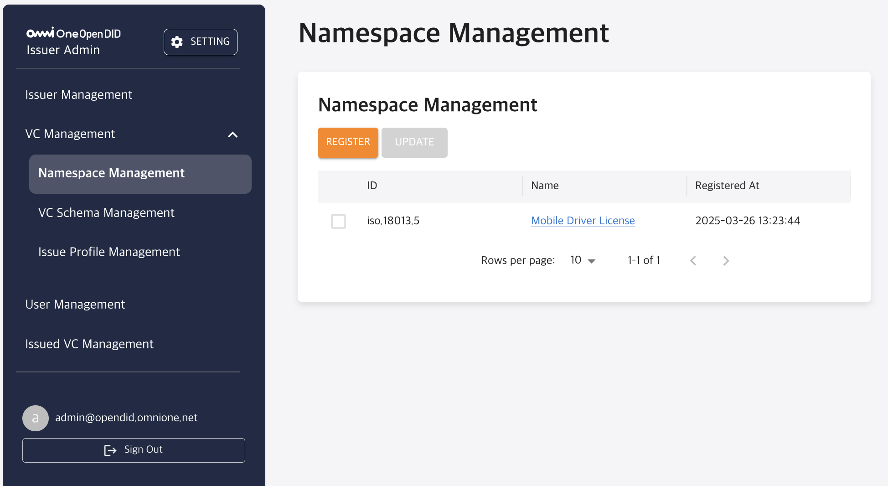

| Item             | Description                             |
|------------------|----------------------------------|
| **ID**           | Unique identifier of the namespace.  |
| **Name**         | Namespace name. Clicking moves to the detailed screen. |
| **Registered At**| Date and time when the namespace was registered. |

- Clicking the `REGISTER` button allows you to register a new namespace.

### ▸ Namespace Registration

In the namespace registration screen, you create a namespace by entering the following information.


| Item            | Description                                              |
|-----------------|---------------------------------------------------|
| **Namespace ID**| Unique identifier of the namespace (e.g., `iso.18013.5`).|
| **Name**        | Namespace name.                           |
| **Ref**         | Reference URL or description related to the namespace.      |
| **Items**       | Items to be included in the namespace. Consists of the following fields:<br>-`ID`, `Type`, `Format`, `Caption`|

- Add items with the `ADD ITEM` button, and you can also delete and modify items.
- After input, click the `REGISTER` button to register.

### ▸ Namespace Detailed Information

Clicking the name in the namespace list allows you to verify detailed information.

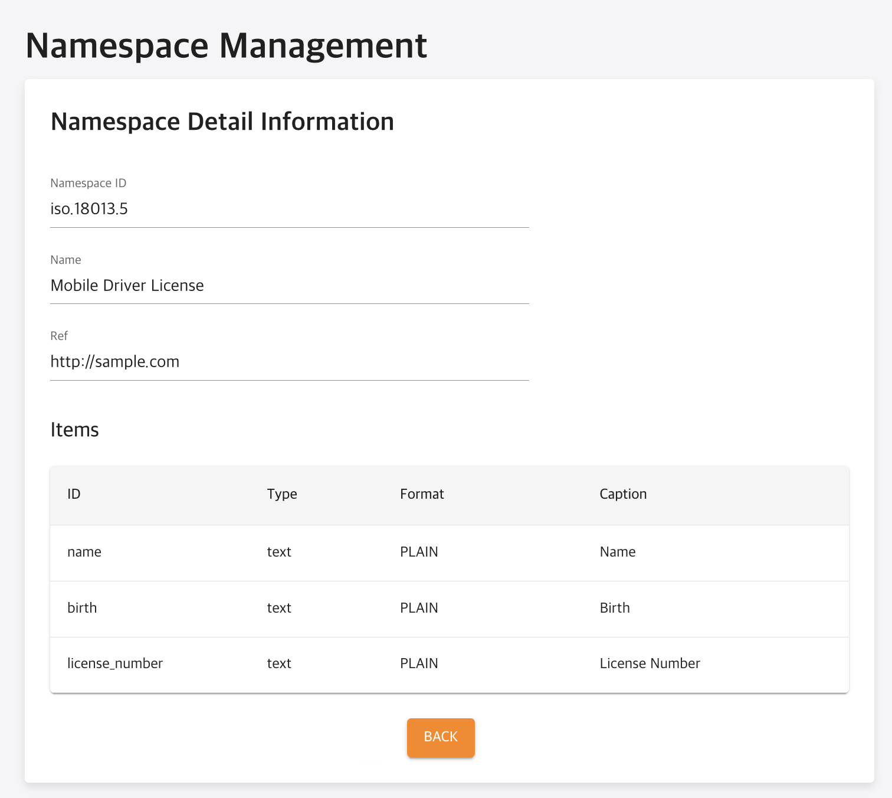

| Item            | Description                             |
|-----------------|----------------------------------|
| **Namespace ID**| Unique identifier of the namespace.  |
| **Name**        | Namespace name.         |
| **Ref**         | Reference URL or description.        |
| **Items**       | List of registered items. Each item consists of ID, Type, Format, Caption.|

- You can move to the edit screen by clicking the `GO TO EDIT` button.

### ▸ Namespace Update

This is a screen where you can modify existing namespace information.

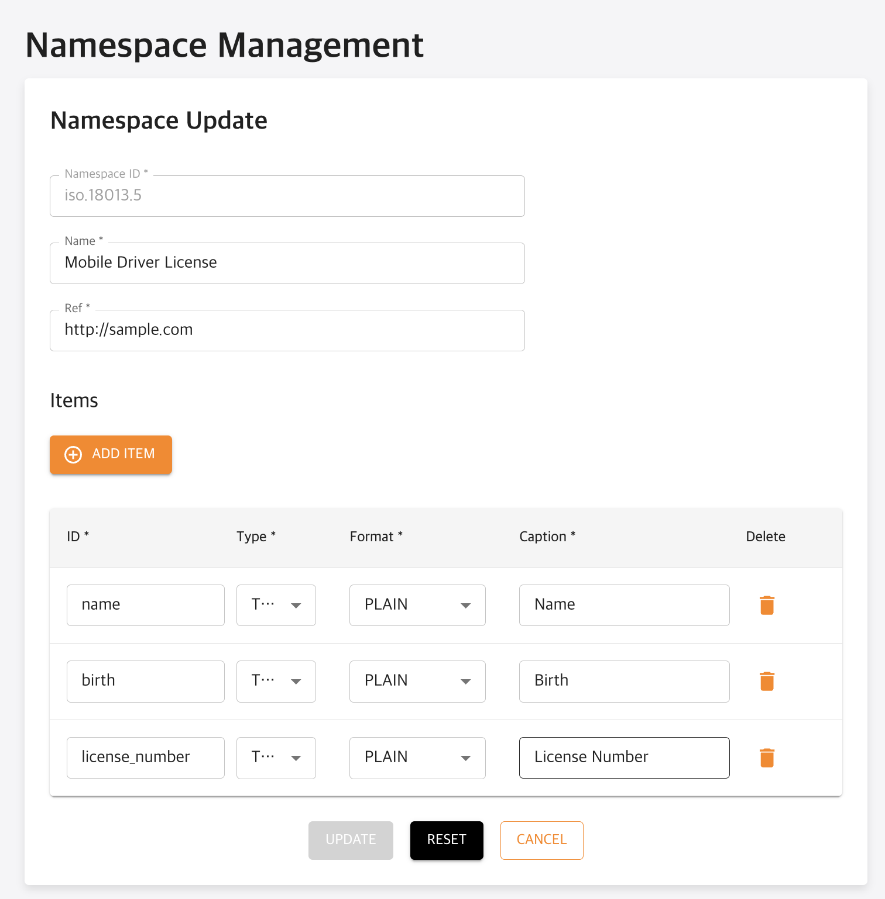

| Item             | Description                                   |
|------------------|----------------------------------------|
| **Namespace ID** | Cannot be modified as it is a unique identifier.  |
| **Name**         | You can modify the namespace name. |
| **Ref**          | You can modify the reference URL or description.|
| **Items**        | You can add, modify, and delete registered items.|

- After modifying changes, click the `UPDATE` button to save.
- The `RESET` button returns the form to its initial state, and you can move to the detailed view screen with the `BACK` button.

---

## 3.3.2. VC Schema Management

VC Schema Management is a menu for registering and managing VC Schemas required for VC issuance. VC Schemas define the data structure of VCs and are referenced in issuance profiles (Issue Profiles).

### ▸ VC Schema List

Verify the list of registered VC Schemas.

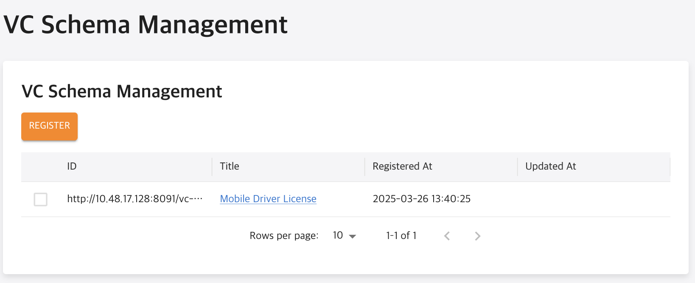

| Item            | Description                             |
|-----------------|----------------------------------|
| **ID**          | Unique identifier of the VC Schema.   |
| **Title**       | Title of the schema. Clicking moves to the detailed screen.|
| **Registered At**| Date and time of initial registration.          |
| **Updated At**  | Date and time of last modification.         |

- You can register a new VC Schema by clicking the `REGISTER` button.

### ▸ VC Schema Registration

Register a new VC Schema.

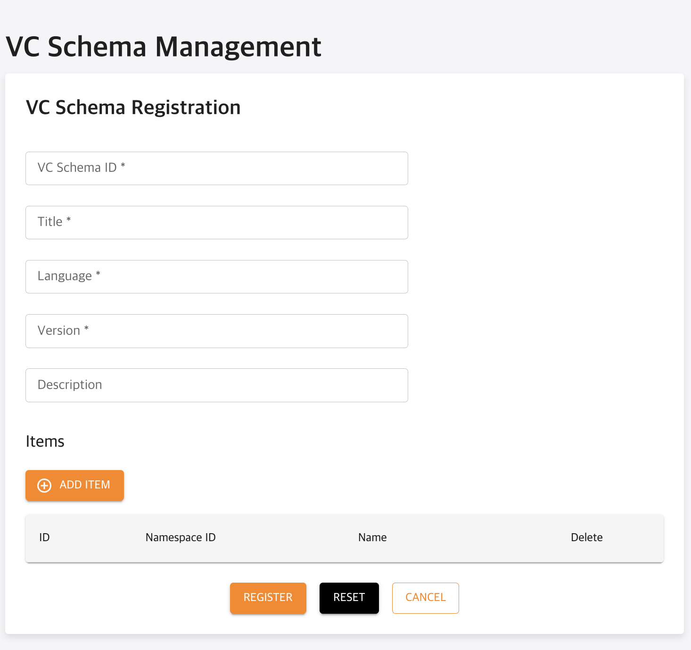

| Item            | Description                                        |
|-----------------|---------------------------------------------|
| **VC Schema ID**| Unique identifier or URL of the VC Schema.      |
| **Title**       | Title of the schema.                         |
| **Language**    | VC Schema language (e.g., `ko`).                   |
| **Version**     | Schema version.                           |
| **Description** | Description of the VC Schema.                 |
| **Items**       | List of namespace-based items to be included in the Schema.|

- After completing input, register with the `REGISTER` button.

---

### ▸ VC Schema Detailed Information

Clicking the title in the VC Schema list allows you to verify detailed information of the schema.

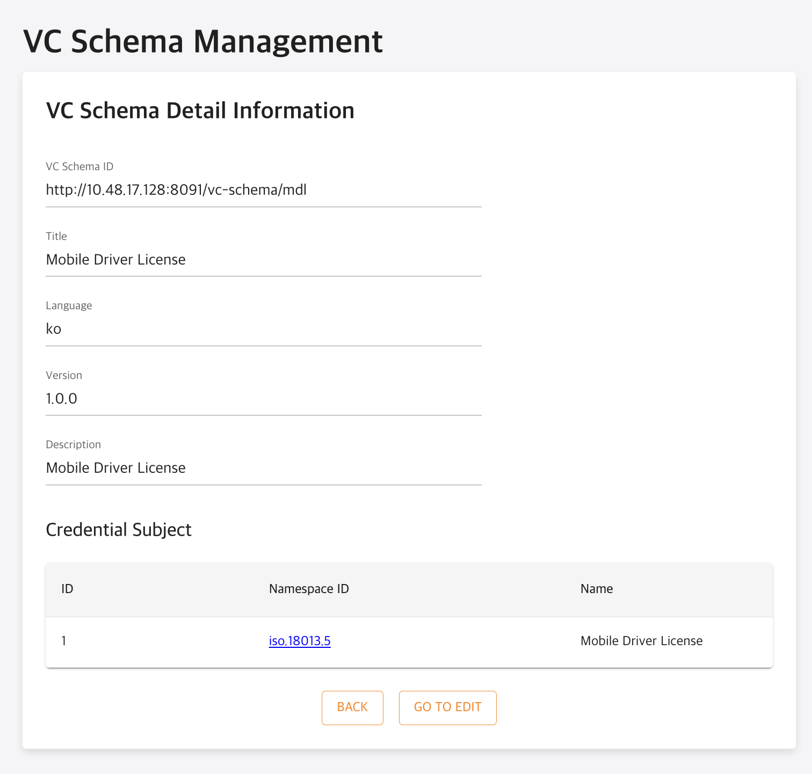

| Item                 | Description                                                    |
|----------------------|---------------------------------------------------------|
| **VC Schema ID**     | Unique URL or ID that identifies the VC Schema.          |
| **Title**            | Title of the VC Schema.                                 |
| **Language**         | Schema description language setting. (e.g., `ko`)                 |
| **Version**          | Version information of the schema.                               |
| **Description**      | Detailed description of the schema.                          |
| **Credential Subject** | List of Namespaces included in the VC Schema. Clicking an item allows you to verify detailed information of that Namespace. |

- Clicking the `GO TO EDIT` button in the detailed information screen moves to the edit screen.

---

### ▸ VC Schema Update

You can modify the content of registered VC Schemas.


| Item              | Description                                                     |
|-------------------|----------------------------------------------------------|
| **VC Schema ID**  | Cannot be modified as it is a unique identifier.                    |
| **Title**         | You can modify the title of the VC Schema.                    |
| **Language**      | You can change the language of the schema description.                  |
| **Version**       | You can change the version of the schema.                       |
| **Description**   | You can modify the detailed description of the schema.                  |
| **Items**         | You can add or delete Namespace items linked to the Schema.<br> - Add items with the `ADD ITEM` button and delete with the trash icon. |

- After modifying changes, click the `UPDATE` button to save.
- The `RESET` button returns the form to its initial state, and you can move to the detailed view screen with the `BACK` button.

---

## 3.3.3. Issue Profile Management

Issue Profile Management is a menu for defining and managing profiles (Issue Profiles) to be used for VC issuance.  
Issue Profiles configure VC Schema and issuance policy information into a single issuance plan, which is referenced during actual VC issuance.

### ▸ Issue Profile List

You can verify the list of registered Issue Profiles.

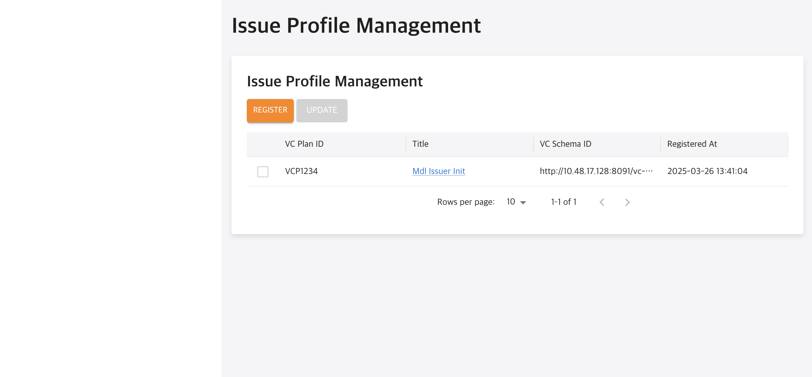

| Item            | Description                                             |
|-----------------|--------------------------------------------------|
| **VC Plan ID**  | Unique ID that identifies the Issue Profile. Clicking moves to the detailed screen.|
| **Title**       | Title of the profile.                            |
| **VC Schema ID**| ID of the linked VC Schema. Clicking moves to the Schema detailed screen.|
| **Registered At**| Date and time when the Issue Profile was registered.               |

- You can register a new Issue Profile by clicking the `REGISTER` button.


---

### ▸ Issue Profile Registration


| Item               | Description                                                                 |
|--------------------|----------------------------------------------------------------------|
| **VC Plan ID**     | Unique identifier of the issuance profile.                                   |
| **Title**          | Title of the issuance profile.                                           |
| **Description**    | Detailed description of the profile. (Optional)                              |
| **VC Schema ID**   | ID of the VC Schema to link. (Selectable with magnifying glass button)              |
| **Initiate Type**  | Setting for how VC issuance requests are initiated<br/>(e.g., User Initiate, Issuer Initiate)|
| **Language**       | Language setting of the profile. (e.g., `ko`)                                |
| **Endpoints**      | List of Endpoint addresses to receive VC issuance requests.                       |
| **E2E**            | End-to-End encryption configuration<br/>- Cipher, Curve, Padding settings available          |
| **Tags**           | Tag information to distinguish or search for this profile.             |
| **ZKP Issuance** | For `Issuer Initiate` method, you can set whether to issue based on ZKP. |
| **Credential Definition ID** | Enter the Credential Definition ID to reference for ZKP issuance.     |

- Turning on the `ZKP Issuance` switch activates the Definition ID input field.
- After entering all items, the profile is registered when you click the `REGISTER` button.  
- The `RESET` button initializes the form, and `CANCEL` cancels registration.

---

### ▸ Issue Profile Detailed Information

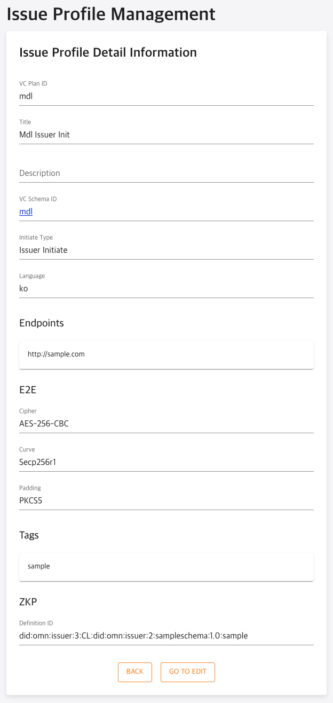

- You can verify detailed information of registered Issue Profiles.
- If `ZKP Issuance` is set, the related Definition ID is displayed at the bottom.

| Item                     | Description                                                  |
|--------------------------|-------------------------------------------------------|
| **VC Plan ID**           | Unique identifier of the issuance profile                          |
| **Title**                | Title of the profile                                       |
| **VC Schema ID**         | ID of the linked VC Schema                                 |
| **Initiate Type**        | Issuance initiation method (`Issuer Initiate`, `User Initiate`)   |
| **Language**             | Profile language                                         |
| **Endpoints**            | List of Endpoints to receive issuance requests                      |
| **E2E**                  | Cipher, Curve, Padding settings                           |
| **Tags**                 | Tag information                                             |
| **ZKP Definition ID**    | Credential Definition ID to be used for ZKP-based issuance       |

- You can move to the edit screen by clicking the `GO TO EDIT` button.

---

### ▸ Issue Profile Update

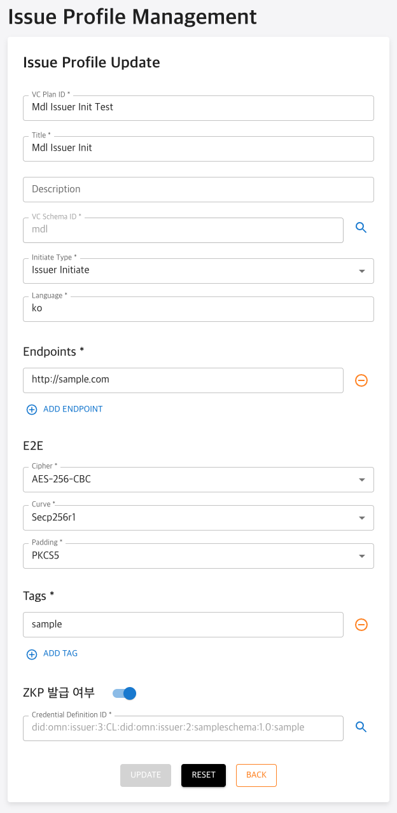

- You can modify the content of registered Issue Profiles.
- The `ZKP Issuance` setting is displayed only when Initiate Type is `Issuer Initiate`.

| Item                     | Description                                                  |
|--------------------------|-------------------------------------------------------|
| **VC Plan ID**           | Cannot be modified.                                   |
| **Title**                | Profile title can be modified                             |
| **VC Schema ID**         | Already linked VC Schema cannot be modified                     |
| **Initiate Type**        | Issuance initiation method can be modified                              |
| **Language**             | Language settings can be modified                                   |
| **Endpoints**            | Can be added and modified                                     |
| **E2E**                  | Cipher, Curve, Padding can be modified                      |
| **Tags**                 | Tags can be added/deleted                                   |
| **ZKP Issuance**        | Can only be set when issuance method is Issuer Initiate           |
| **Credential Definition ID** | Specifies Definition ID used for ZKP issuance             |

- Save changes by clicking the `UPDATE` button.
- `RESET` initializes input values, and `BACK` moves to the detailed view screen.

---

## 3.4. ZKP Management

The ZKP Management menu provides registration and management functions for **Namespace**, **Credential Schema**, and **Credential Definition** for Zero-Knowledge Proof-based Credential issuance.

To configure ZKP-based issuance flow, the following three steps must be performed sequentially:

1. **ZKP Namespace Registration** – Define the list of Claims to be used  
2. **Credential Schema Registration** – Define issuance schema based on Namespace  
3. **Credential Definition Registration** – Configure definition for actual issuance

ZKP-related functions are provided as a separate top-level menu from [3.3. VC Management].

---

## 3.4.1. ZKP Namespace Management

This is a space for defining sets of Claims to be used for ZKP issuance, including label, type, and caption information for each Claim.

### ▸ Namespace List

- You can verify the list of previously registered ZKP Namespaces.
- Each item displays ID, Name, Schema Count, and registration/modification date and time.
- Clicking Name moves to the detailed screen.

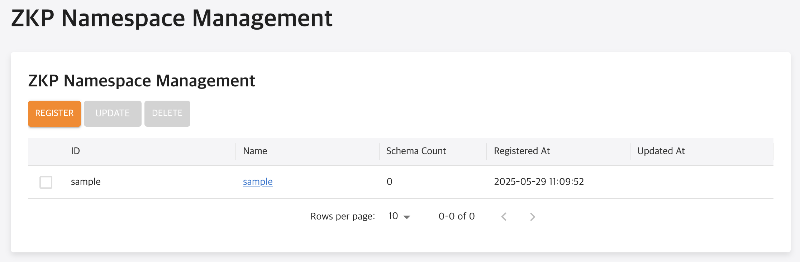

| Item            | Description                                     |
|-----------------|------------------------------------------|
| **ID**          | Unique ID of the Namespace                      |
| **Name**        | Namespace name (clicking moves to detailed screen)  |
| **Schema Count**| Number of Schemas referencing this Namespace     |
| **Registered At**| Initial registration date and time                          |
| **Updated At**   | Last modification date and time                         |

- `REGISTER` button: Moves to new Namespace registration screen  
- When selecting items, `UPDATE`, `DELETE` buttons are activated

---

### ▸ Namespace Registration

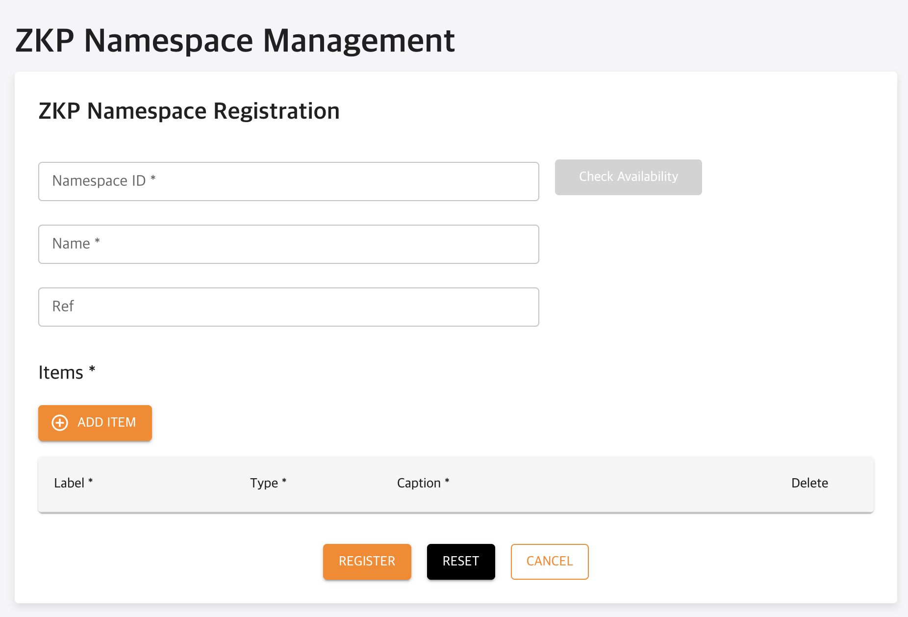

| Item             | Description                                                              |
|------------------|-------------------------------------------------------------------|
| **Namespace ID** | Unique identifier (duplicate check required)                                       |
| **Name**         | Namespace name                                                    |
| **Ref**          | Related description or reference link                                           |
| **Items**        | List of Claim items to include (Label, Type, Caption required)                 |

- You can add items with the `ADD ITEM` button.  
- Click the `REGISTER` button when registration is complete  
- `RESET` button initializes the form, `CANCEL` cancels registration

---

### ▸ Namespace Detailed Information

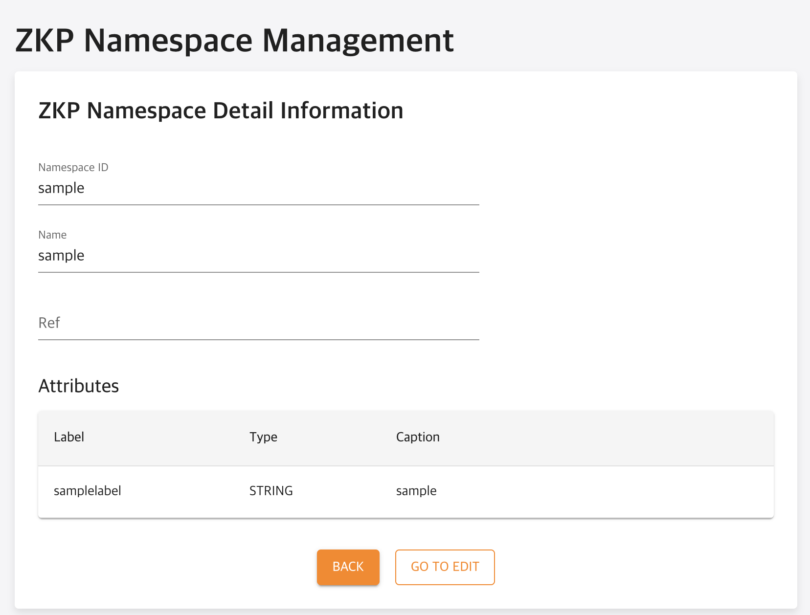

- You can view registered Namespace information.
- You can verify the list of Claim items in the Attributes table at the bottom.
- Clicking the `GO TO EDIT` button moves to the edit screen

---

### ▸ Namespace Update

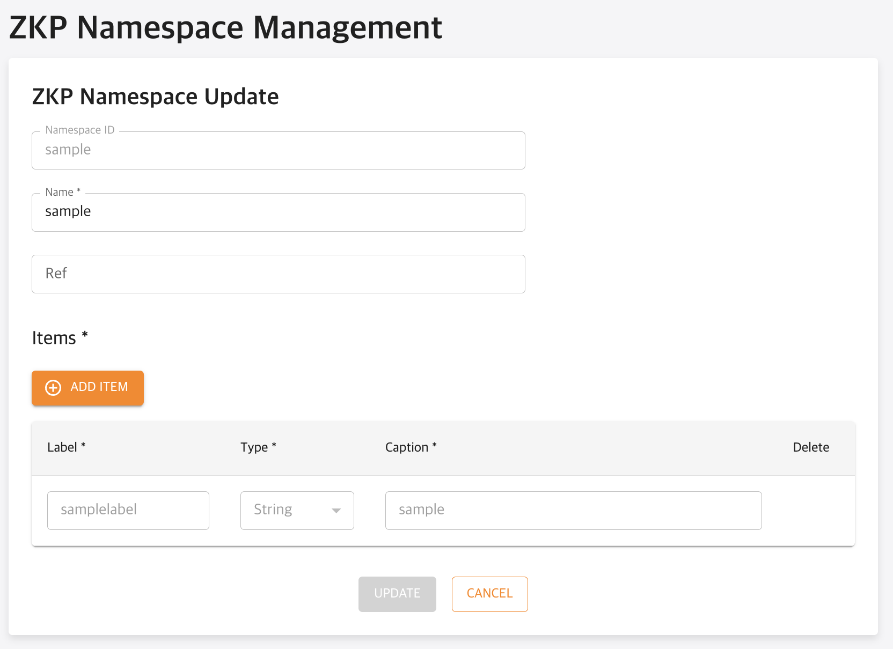

- Claim items can be added/deleted and content can be modified.
- Save with the `UPDATE` button after modification

---

## 3.4.2. Credential Schema Management

Defines ZKP Credential Schema composed based on Namespace. This schema structure is used when issuing ZKP VCs.

### ▸ Credential Schema List

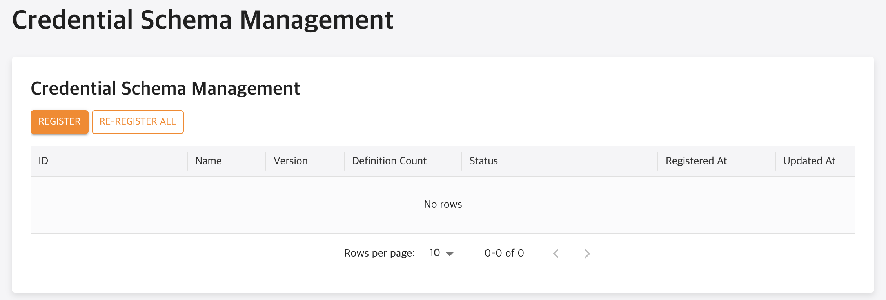

- If no registered schemas exist, it displays "No rows".
- Clicking the `REGISTER` button allows new schema registration

---

### ▸ Credential Schema Registration

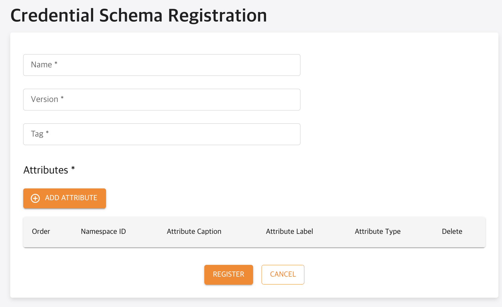

| Item         | Description                                                           |
|--------------|----------------------------------------------------------------|
| **Name**     | Schema name                                                    |
| **Version**  | Schema version (e.g., 1.0)                                           |
| **Tag**      | Tag for schema identification                                              |
| **Attributes**| List of configuration items (composed of Namespace ID, Caption, Label, Type) |

- Add configuration items with the `ADD ATTRIBUTE` button  
- Items are selected based on ZKP Namespace

---

### ▸ Credential Schema Detailed Information

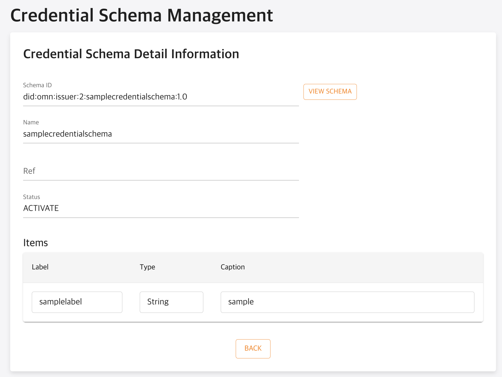

- You can verify detailed information of registered schemas.
- Each item (Label, Type, Caption) is displayed in table format.

---

## 3.4.3. Credential Definition Management

Credential Definition is a schema-based definition to be used when issuing actual Credentials.  
Definition ID must be unique in the ZKP network and is connected 1:1 with the schema.

### ▸ Credential Definition List

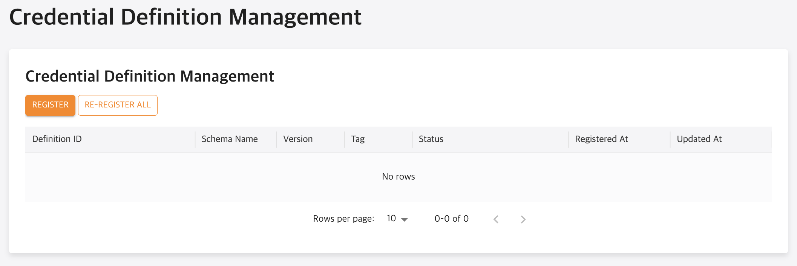

- If no registered Definitions exist, it displays "No rows".
- Clicking the `REGISTER` button allows new Definition registration

---

### ▸ Credential Definition Registration

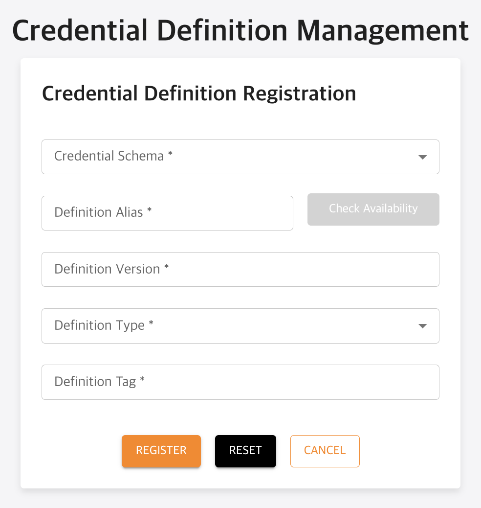

| Item               | Description                                               |
|--------------------|----------------------------------------------------|
| **Credential Schema** | Select registered schema (dropdown method)               |
| **Definition Alias** | Alias for identifying the definition                                 |
| **Definition Version** | Definition version                                        |
| **Definition Type** | Usage method selection (e.g., CL)                            |
| **Definition Tag** | Tag information                                           |

- Click the `REGISTER` button after completing registration
- `Check Availability` can verify Definition Alias duplication

---

### ▸ Credential Definition Detailed Information

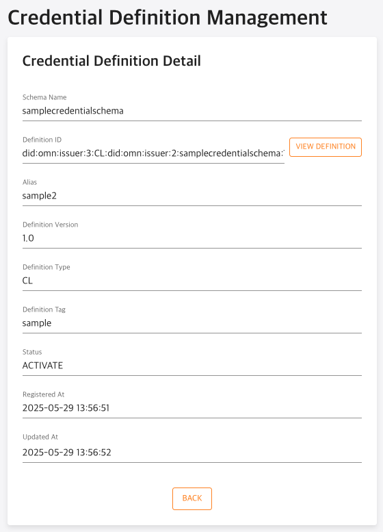

- You can verify information such as Definition ID, Alias, linked Schema, status, etc.
- Defined content cannot be deleted and can only be viewed

---

## 3.5. User Management

User Management is a menu for managing user information for VC recipients.  
Users are registered based on DID, and user VC data is stored based on one VC Schema.

---

### ▸ User List

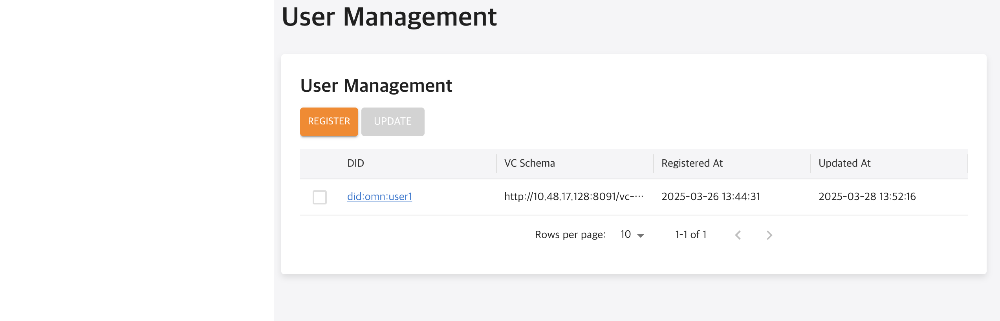

| Item | Description |
|------|------|
| **DID** | User's DID. Clicking moves to the detailed information screen. |
| **VC Schema** | ID of the VC Schema the user is linked to |
| **Registered At** | Initial registration date and time |
| **Updated At** | Last modification date and time |

> Move to new user registration screen with the `REGISTER` button,  
> Select items from the list and use the `UPDATE` button to modify.

---

### ▸ User Registration (Register)

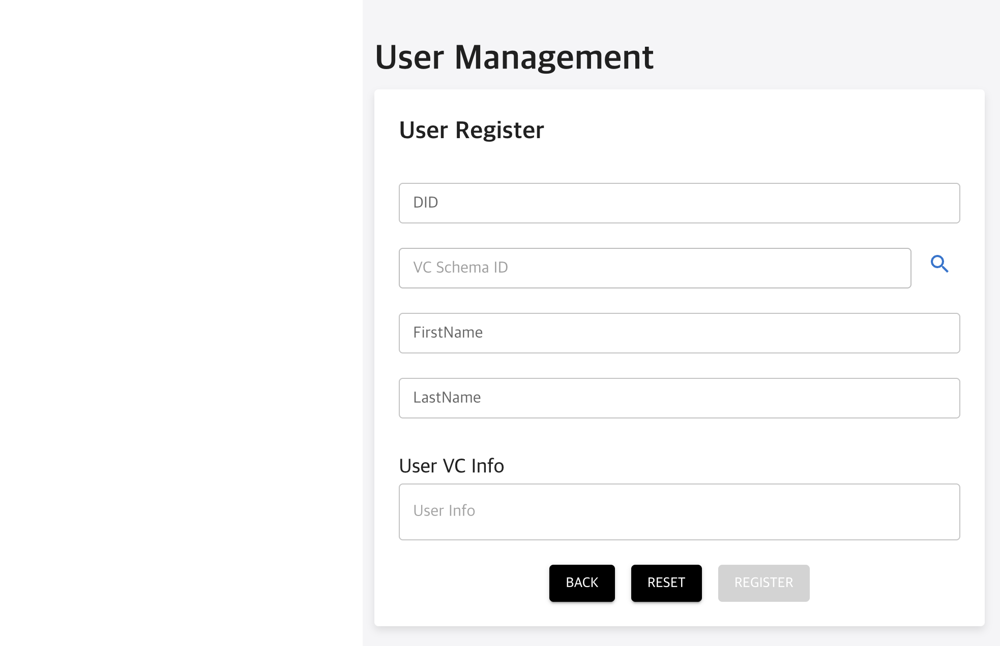

| Item | Description |
|------|------|
| **DID** | User's DID (unique identifier) |
| **VC Schema ID** | Schema ID of the VC to be issued (selectable by clicking magnifying glass icon) |
| **FirstName / LastName** | User's name information. Internally merged and stored as `PII`. |
| **User VC Info** | User information to be used for VC issuance (input in JSON format) |

- For `User VC Info`, input must be based on the Namespace included in the previously registered VC Schema. 
- `{Namespace_ID}.{CLAIM_ID}`
 - Example: {"iso.18013.5.name": "KimRaon", "iso.18013.5.birth_date": "2000-01-01"}

> After entering all required items, click the `REGISTER` button to register the user.  
> `RESET` initializes input values, and `BACK` returns to the list screen.

---

### ▸ User Detailed Information


| Item | Description |
|------|------|
| **DID** | User's unique identifier (Decentralized Identifier) |
| **VC Schema Name** | VC Schema ID referenced by this user's VC |
| **PII** | User's Personal Identifiable Info |
| **User VC Info** | VC data to be issued to the user (JSON format) |
| **Created At** | User registration date and time |
| **Updated At** | Last modification date and time |

> You can move to the edit screen with the `GO TO EDIT` button.

---

### ▸ User Information Update

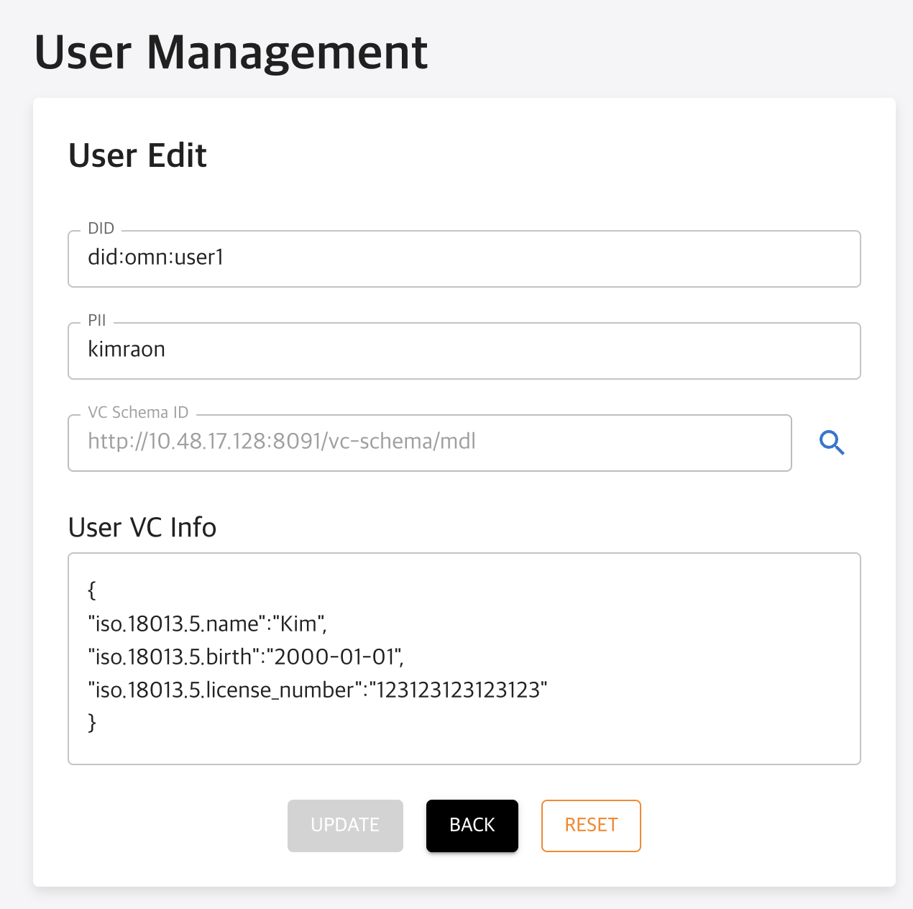

| Item | Description |
|------|------|
| **DID** | User's unique identifier |
| **PII** | Personal identification information |
| **VC Schema ID** | Linked VC Schema |
| **User VC Info** | VC data to be issued to the user (input/modifiable in JSON format) |

> Once editing is complete, you can save by clicking the `UPDATE` button.  
> `RESET` returns the entered content to its initial state, and `BACK` returns to the detailed screen.

## 3.6. Issued VC Management

Issued VC Management is a function that allows you to view the list of issued Verifiable Credentials (VCs) and manage their status.  
This screen provides an **UPDATE function** for changing VC status.

### ▸ VC List

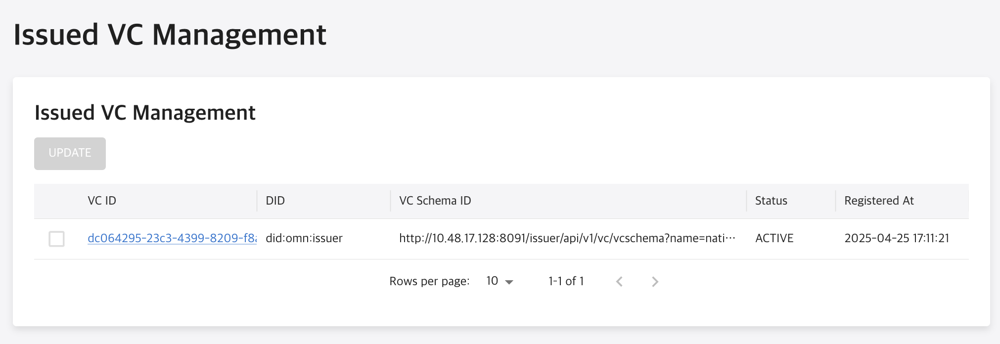

| Item | Description |
|------|------|
| **VC ID** | VC unique identifier (moves to details) |
| **DID** | DID of the user who received the VC |
| **Registered At** | Issuance date and time |

- When you select an item from the list, the `UPDATE` button at the top becomes active.

### ▸ VC Status Change

You can change the status of the selected VC. Status changes are possible according to the following conditions.

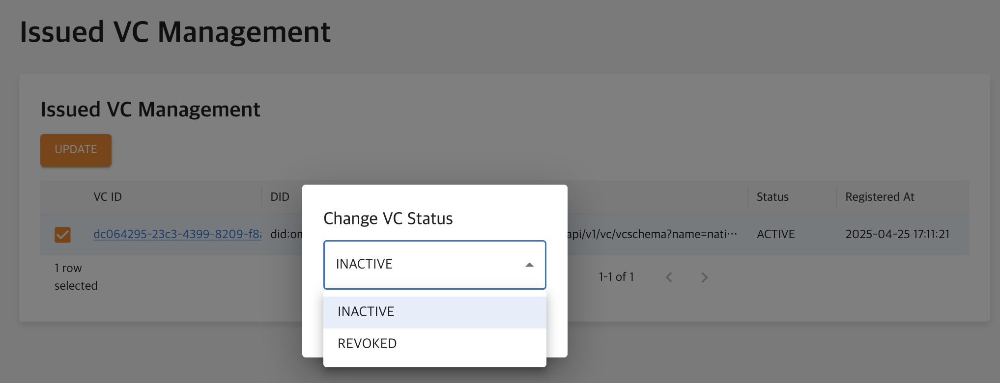

| Current Status | Changeable Status |
|-----------|----------------|
| `ACTIVE` | `INACTIVE`, `REVOKED` |
| `INACTIVE` | `ACTIVE`, `REVOKED` |
| `REVOKED` | (Cannot be changed) |

> **Note**  
> The `REVOKED` status is immutable and cannot be recovered or changed.  
> Status changes are functions for managing and tracking the validity of user VCs.

1. Select an item from the VC list and click the `UPDATE` button  
2. Select status in the **Change VC Status** dialog  
3. After confirmation and saving, the VC status is changed

### ▸ VC Detailed Information

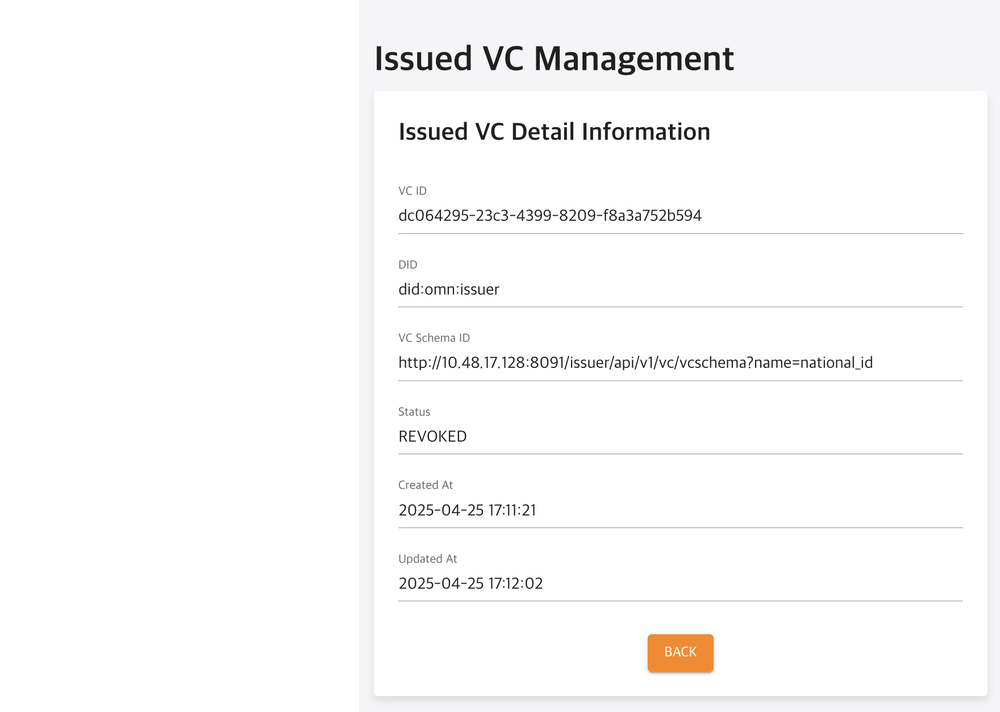

| Item | Description |
|------|------|
| **VC ID** | Unique identifier |
| **DID** | User DID |
| **VC Schema** | VC schema that was issued |
| **Status** | VC status (`ACTIVE`, `REVOKE`, etc.) |
| **Created At / Updated At** | Creation and modification time |

> Currently only viewing is possible, and functions such as status changes may be added in the future.


## 3.7. Admin Management

The `Admin Management` menu is a function for managing administrator accounts that can access the Issuer Admin Console.  

When you install the Issuer server, the `admin@opendid.omnione.net` account is automatically created with ROOT privileges by default.  
This account is the only ROOT account in the system and cannot be deleted.

Administrator accounts are divided into two privilege types: **ROOT** and **Normal Admin**.  
ROOT accounts can perform all functions in the `Admin Management` menu, while Normal Admin accounts can only perform general inquiry functions.

---
> **Note:** Currently, the difference in privileges between ROOT accounts and Normal Admin accounts is  
> only the difference in buttons displayed in the `Admin Management` menu (only Root can REGISTER / DELETE / CHANGE PASSWORD).  
> Access permissions or functional restrictions for other menus in the system are not yet applied.
---

<br/>

### 3.7.1 Admin List Inquiry


When you enter the `Admin Management` menu, a list of registered administrator accounts is displayed in table format.

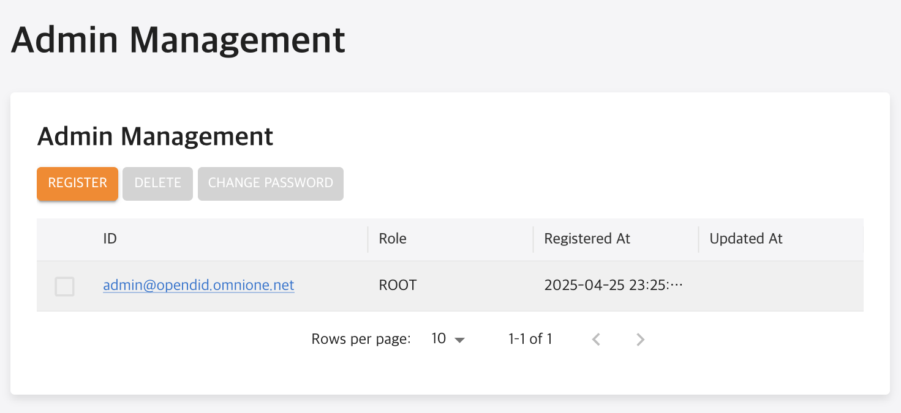


| Number | Item                    | Description                                                             |
| ---- | ----------------------- | ---------------------------------------------------------------- |
| 1    | **REGISTER Button**       | Moves to the registration page where you can register a new administrator account.       |
| 2    | **DELETE Button**         | Deletes the selected administrator account. (Only available to ROOT administrators)              |
| 3    | **CHANGE PASSWORD Button** | Allows you to change the password of the selected administrator account.                |
| 4    | **ID**                  | Email ID of the registered administrator account.                              |
| 5    | **Role**                | Role of the administrator account. (e.g., ROOT, Normal Admin, etc.)   |
| 6    | **Registered At**       | Date and time when the account was initially registered.                               |
| 7    | **Updated At**          | Date and time of last modification.     

<br/>

### 3.7.2. Admin Registration

Clicking the **REGISTER** button on the `Admin Management` screen moves to the registration screen as shown below.

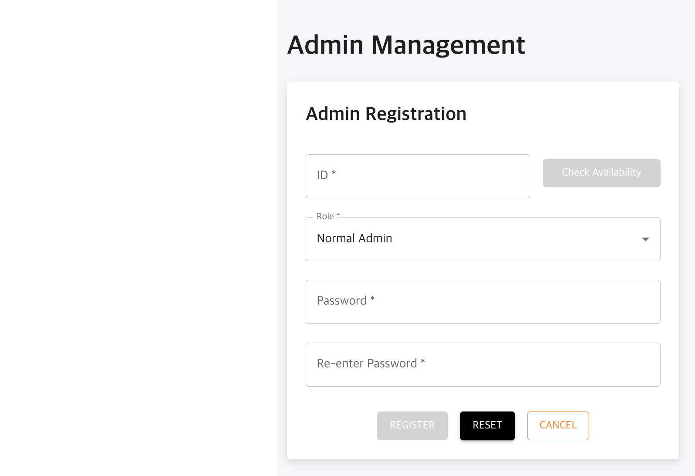

| Number | Item                        | Description                                                                |
| ---- | --------------------------- | ------------------------------------------------------------------- |
| 1    | **ID**                      | ID of the administrator account to register. Must use email format.         |
| 2    | **Check Availability Button** | Verifies that the entered ID is not duplicated.                             |
| 3    | **Role**                    | Select the privileges of the administrator account to register. (e.g., Normal Admin)           |
| 4    | **Password**                | Enter the password to be used for login.                              |
| 5    | **Re-enter Password**       | Enter the password again to verify if it matches.                |
| 6    | **REGISTER Button**           | Registers the administrator account based on the entered information.                    |
| 7    | **RESET Button**              | Initializes all input values.                                         |
| 8    | **CANCEL Button**             | Cancels registration and returns to the previous screen.                           |


[Open DID Installation Guide]: https://github.com/OmniOneID/did-release/blob/develop/unrelease-V2.0.0.0/OepnDID_Installation_Guide-V2.0.0.0_ko.md