---
puppeteer:
    pdf:
        format: A4
        displayHeaderFooter: true
        landscape: false
        scale: 0.8
        margin:
            top: 1.2cm
            right: 1cm
            bottom: 1cm
            left: 1cm
    image:
        quality: 100
        fullPage: false
---

OpenDID IssuerAdmin Operation Guide
==

- Date: 2025-03-31
- Version: v1.0.0

목차
==

- [OpenDID IssuerAdmin Operation Guide](#opendid-issueradmin-operation-guide)
- [목차](#목차)
- [1. 소개](#1-소개)
  - [1.1. 개요](#11-개요)
  - [1.2. Admin Console 정의](#12-admin-console-정의)
- [2. 기본 메뉴얼](#2-기본-메뉴얼)
  - [2.1. 로그인](#21-로그인)
  - [2.2. 메인 화면 구성](#22-메인-화면-구성)
  - [2.3. 메뉴 구성](#23-메뉴-구성)
    - [2.3.1. Issuer 미등록 상태](#231-issuer-미등록-상태)
    - [2.3.2. Issuer 등록 상태](#232-issuer-등록-상태)
  - [2.4. 비밀번호 변경 관리](#24-비밀번호-변경-관리)
- [3. 기능별 상세 메뉴얼](#3-기능별-상세-메뉴얼)
  - [3.1. Issuer Management](#31-issuer-management)
    - [▸ Issuer Manegement](#-issuer-manegement)
  - [3.2. VC Management](#32-vc-management)
  - [3.2.1. Namespace Management](#321-namespace-management)
    - [▸ Namespace 목록](#-namespace-목록)
    - [▸ Namespace 등록](#-namespace-등록)
    - [▸ Namespace 상세 정보](#-namespace-상세-정보)
    - [▸ Namespace 수정 (Update)](#-namespace-수정-update)
  - [3.2.2. VC Schema Management](#322-vc-schema-management)
    - [▸ VC Schema 목록](#-vc-schema-목록)
    - [▸ VC Schema 등록](#-vc-schema-등록)
    - [▸ VC Schema 상세 정보](#-vc-schema-상세-정보)
    - [▸ VC Schema 수정 (Update)](#-vc-schema-수정-update)
  - [3.2.3. Issue Profile Management](#323-issue-profile-management)
    - [▸ Issue Profile 목록](#-issue-profile-목록)
    - [▸ Issue Profile 등록](#-issue-profile-등록)
    - [▸ Issue Profile 상세 정보](#-issue-profile-상세-정보)
    - [▸ Issue Profile 수정 (Update)](#-issue-profile-수정-update)
    - [3.3. User Management](#33-user-management)
      - [▸ 사용자 목록](#-사용자-목록)
      - [▸ 사용자 등록 (Register)](#-사용자-등록-register)
      - [▸ 사용자 상세 정보](#-사용자-상세-정보)
      - [▸ 사용자 정보 수정 (Update)](#-사용자-정보-수정-update)
    - [3.4. Issued VC Management](#34-issued-vc-management)
      - [▸ VC 목록](#-vc-목록)
      - [▸ VC 상세 정보](#-vc-상세-정보)

---

# 1. 소개

## 1.1. 개요

본 문서는 Open DID Issuer Admin Console의 설치 및 구동 방법을 안내합니다.
기본 사용법부터 각 기능별 상세 매뉴얼까지 단계적으로 설명하여, 사용자가 콘솔을 효율적으로 활용할 수 있도록 구성되어 있습니다.

OpenDID의 전체 설치에 대한 가이드는 [Open DID Installation Guide]를 참고해 주세요.

## 1.2. Admin Console 정의

**Issuer Admin Console**은 Open DID 시스템 내에서 **Issuer 서버**를 관리하기 위한 웹 기반의 관리자 도구입니다.

Issuer는 Verifiable Credential(VC)의 발급 주체로서, VC 발급과 관련된 네임스페이스, 스키마, 발급 정책(프로파일) 등의 관리 기능을 제공합니다.

Issuer Admin Console에서 설정할 수 있는 주요 항목은 다음과 같습니다:

- **Issuer 기본 정보 관리**
  - Issuer 서버 등록 및 상태 확인
- **VC 발급 항목 관리**
  - Namespace 등록 및 항목 구성
  - VC Schema 등록 및 관리
  - 발급 정책(Profile) 설정
- **사용자 및 VC 이력 관리**
  - 발급 대상 사용자 관리
  - 발급된 VC 목록 확인 및 상태 추적

# 2. 기본 메뉴얼

이 장에서는 Open DID Issuer Admin Console의 기본적인 사용 방법에 대해 안내합니다.

## 2.1. 로그인

Issuer Admin Console에 접속하려면 다음 단계를 따르세요:

1. 웹 브라우저를 열고 Issuer Admin Console URL에 접속합니다.

   ```
   http://<issuer_domain>:<port>
   ```

2. 로그인 화면에서 관리자 계정의 이메일과 비밀번호를 입력합니다.
   - 기본 관리자 계정: <admin@opendid.omnione.net>
   - 초기 비밀번호: password (최초 로그인 시 변경 필요)

3. '로그인' 버튼을 클릭합니다.

> **참고**:  
> 보안상의 이유로 최초 로그인 시에는 비밀번호 변경이 필요합니다.

<br/>


## 2.2. 메인 화면 구성

로그인 후 표시되는 메인 화면은 다음과 같은 요소들로 구성되어 있습니다:


| 번호 | 영역             | 설명                                                                                                                                |
| ---- | ---------------- | ----------------------------------------------------------------------------------------------------------------------------------- |
| 1    | 헤더 영역        | 우측 상단의 `SETTING` 버튼을 통해 비밀번호 변경 화면으로 이동할 수 있습니다.                                                        |
| 2    | 콘텐츠 영역      | 현재 선택된 메뉴의 제목과 해당 콘텐츠가 표시됩니다. 각 메뉴에 따라 화면 내용이 바뀝니다.                                            |
| 3    | 사이드 메뉴      | 화면 왼쪽에 위치하며, 주요 메뉴 항목들이 세로로 정렬되어 있습니다. 선택한 메뉴는 강조 표시되며, 필요한 경우 하위 메뉴가 펼쳐집니다. |
| 4    | 사용자 정보 영역 | 현재 로그인한 관리자의 이메일 주소와 '로그아웃(Sign Out)' 버튼이 표시됩니다.                                                        |


<br/>

## 2.3. 메뉴 구성

Issuer Admin Console의 사이드바 메뉴는 **Issuer 등록 상태에 따라 화면 구성에 차이**가 있습니다.


<br/>

### 2.3.1. Issuer 미등록 상태

Issuer 서버가 아직 등록되지 않은 초기 상태에서는
메뉴에 Issuer Registration 항목만 단독으로 표시됩니다.


> 참고: Issuer 등록이 완료되면 관련 기능들이 활성화되며, 전체 메뉴가 확장됩니다.
등록 이후 메뉴 구성에 대한 자세한 내용은 추후 항목에서 설명합니다.

### 2.3.2. Issuer 등록 상태

Issuer 등록이 완료되면 전체 관리 기능이 활성화되며, 사이드바 메뉴는 다음과 같이 구성됩니다:


| 번호 | 메뉴 명칭 | Depth | 설명 |
|------|-----------|--------|------|
| 1 | **Issuer Management** | 1 | Issuer 서버의 기본 정보(DID, 상태 등)를 확인하고 관리하는 메뉴입니다. |
| 2 | **VC Management** | 1 | VC 발급과 관련된 항목들을 설정할 수 있는 상위 메뉴입니다. |
| 3 | └ Namespace Management | 2 | VC 발급에 사용되는 namespace를 등록하고 관리하는 메뉴입니다. |
| 4 | └ VC Schema Management | 2 | VC 발급에 사용될 VC 스키마를 등록하고 관리하는 메뉴입니다. |
| 5 | └ Issue Profile Management | 2 | VC 발급 시 필요한 프로파일 정보를 관리하는 메뉴입니다. |
| 6 | **User Management** | 1 | VC를 발급받을 사용자 정보를 관리하는 메뉴입니다. |
| 7 | **Issued VC Management** | 1 | 발급된 VC의 목록을 확인하고 관리할 수 있는 메뉴입니다. |

> **참고**:  
> 위 메뉴 구성에 대한 각 기능의 상세 사용법은  
> [3장. 기능별 상세 메뉴얼](#3-기능별-상세-메뉴얼)에서 번호 순서에 따라 설명합니다.
<br/>

## 2.4. 비밀번호 변경 관리

사용자 비밀번호 변경은 다음 단계를 통해 수행할 수 있습니다:

1. 헤더 영역의 'SETTING' 버튼을 클릭합니다.
2. 설정 메뉴에서 '비밀번호 변경'을 선택합니다.
3. 비밀번호 변경 화면에서:
   - 현재 비밀번호 입력
   - 새 비밀번호 입력
   - 새 비밀번호 확인 입력
4. '저장' 버튼을 클릭하여 변경 사항을 적용합니다.

> **참고**: 비밀번호는 8자 이상, 64자 이하의 알파벳 대/소문자, 숫자, 특수문자를 포함해야 합니다.

<br/>

# 3. 기능별 상세 메뉴얼

이 장에서는 Issuer Admin Console의 주요 기능에 대한 상세 사용 방법을 안내합니다.

## 3.1. Issuer Management

Issuer Management는 Issuer 서버의 기본 정보를 등록하고 관리하는 메뉴입니다. Issuer는 VC(Verifiable Credential)의 발급 주체로서 시스템 내에서 고유한 DID를 가지고 등록되어야 하며, 최초 1회만 등록이 필요합니다.  

Issuer가 등록되면 시스템에 활성 상태(`ACTIVATE`)로 표시되며, 등록 이후에는 등록된 정보를 열람하거나 제한된 범위 내에서 변경할 수 있습니다.

### ▸ Issuer Manegement

> **참고**  
현재는 Quick Register 방식의 간편 등록만 지원하며, 정식 등록 절차는 2025년 6월에 업데이트될 예정입니다.

Issuer Manegement 화면은 다음 항목들로 구성되어 있습니다.

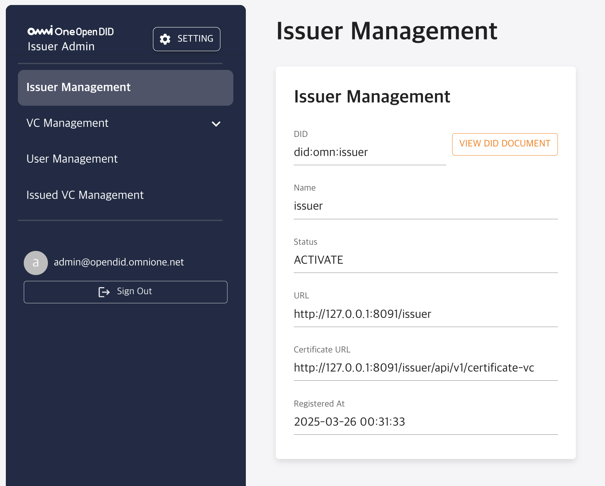

| 항목              | 설명                                                           |
|-------------------|----------------------------------------------------------------|
| **DID**           | Issuer를 식별하는 고유한 DID로, 시스템에서 자동 발급됩니다.     |
| **Name**          | 등록할 Issuer의 이름입니다.                                    |
| **Status**        | Issuer의 상태를 나타냅니다. 등록 완료 시 `ACTIVATE`로 표시됩니다. |
| **URL**           | Issuer 서버의 기본 URL입니다.                                  |
| **Certificate URL** | Issuer의 가입증명서를 확인할 수 있는 URL 주소입니다.          |
| **Registered At** | Issuer의 최초 등록 일시입니다.                                 |

- DID Document는 화면의 `VIEW DID DOCUMENT` 버튼을 통해 확인할 수 있습니다.
- 등록된 Issuer 정보는 삭제가 불가능하며, 일부 항목에 대해 제한된 범위 내에서만 수정이 가능합니다.

## 3.2. VC Management

VC Management는 Issuer가 발급하는 VC(Verifiable Credential)를 정의하고 관리하기 위한 메뉴입니다. VC를 발급하기 위해서는 사전에 Namespace와 VC Schema를 등록하여 VC 구조를 정의하고, 발급 정책(Issue Profile)을 설정해야 합니다.

VC Management는 다음 세 가지 하위 메뉴로 구성되어 있습니다.

- Namespace Management
- VC Schema Management
- Issue Profile Management

---

## 3.2.1. Namespace Management

Namespace Management는 VC의 구조를 정의할 때 사용되는 네임스페이스(Namespace)를 등록하고 관리하는 메뉴입니다. 네임스페이스는 VC Schema 및 Issue Profile 설정 시에 참조됩니다.

### ▸ Namespace 목록

Namespace 목록 화면에서는 등록된 네임스페이스들을 확인할 수 있습니다.


| 항목             | 설명                             |
|------------------|----------------------------------|
| **ID**           | 네임스페이스의 고유 식별자입니다.  |
| **Name**         | 네임스페이스 이름입니다. 클릭 시 상세 화면으로 이동합니다. |
| **Registered At**| 네임스페이스가 등록된 일시입니다. |

- `REGISTER` 버튼을 클릭하면 네임스페이스를 새로 등록할 수 있습니다.

### ▸ Namespace 등록

네임스페이스 등록 화면에서는 다음 정보를 입력하여 네임스페이스를 생성합니다.

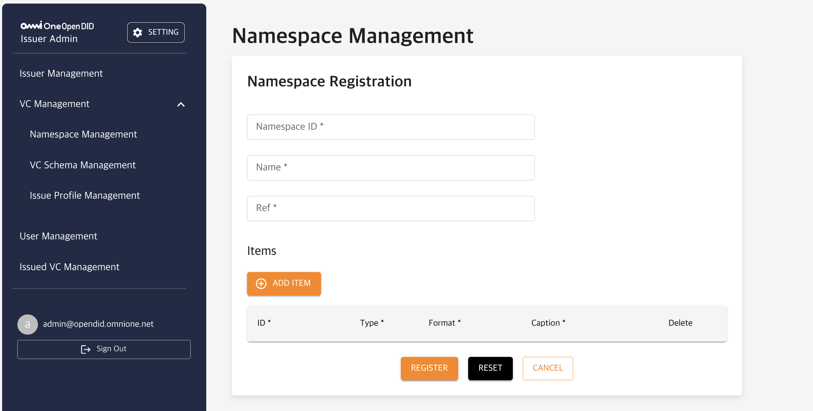

| 항목            | 설명                                              |
|-----------------|---------------------------------------------------|
| **Namespace ID**| 네임스페이스의 고유 식별자(예: `iso.18013.5`)입니다.|
| **Name**        | 네임스페이스 이름입니다.                           |
| **Ref**         | 네임스페이스와 관련된 참조 URL 또는 설명입니다.      |
| **Items**       | 네임스페이스에 포함될 항목입니다. 다음 필드로 구성됩니다:<br>-`ID`, `Type`, `Format`, `Caption`|

- `ADD ITEM` 버튼으로 항목을 추가하며, 항목 삭제 및 수정도 가능합니다.
- 입력 후 `REGISTER` 버튼을 클릭하여 등록합니다.

### ▸ Namespace 상세 정보

네임스페이스 목록에서 이름을 클릭하면 상세 정보를 확인할 수 있습니다.

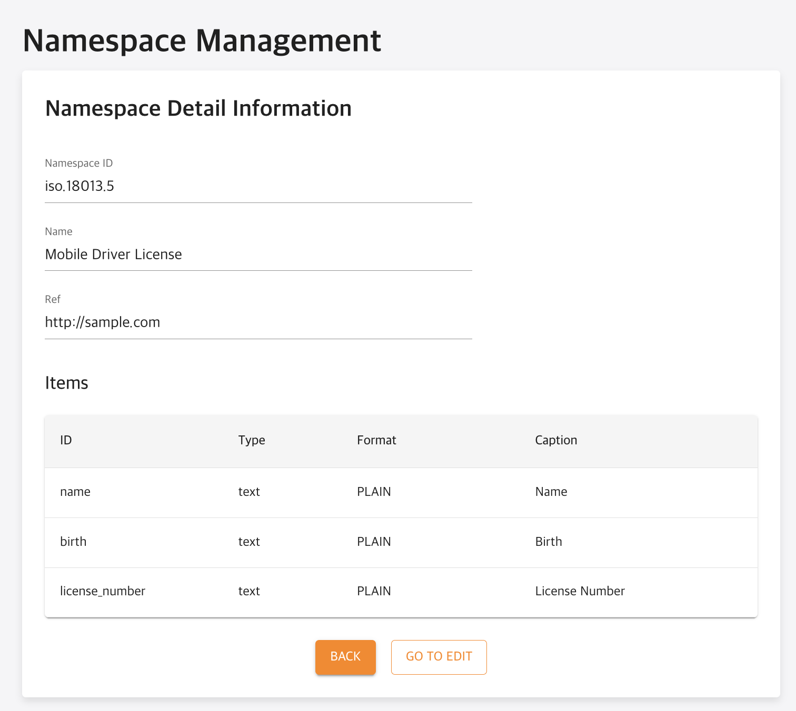

| 항목            | 설명                             |
|-----------------|----------------------------------|
| **Namespace ID**| 네임스페이스 고유 식별자입니다.  |
| **Name**        | 네임스페이스 이름입니다.         |
| **Ref**         | 참조 URL 또는 설명입니다.        |
| **Items**       | 등록된 항목 목록입니다. 각 항목은 ID, Type, Format, Caption으로 구성됩니다.|

- `GO TO EDIT` 버튼을 클릭하여 수정 화면으로 이동할 수 있습니다.

### ▸ Namespace 수정 (Update)

네임스페이스의 기존 정보를 수정할 수 있는 화면입니다.


| 항목             | 설명                                   |
|------------------|----------------------------------------|
| **Namespace ID** | 고유 식별자이므로 수정할 수 없습니다.  |
| **Name**         | 네임스페이스 이름을 수정할 수 있습니다. |
| **Ref**          | 참조 URL 또는 설명을 수정할 수 있습니다.|
| **Items**        | 등록된 항목을 추가, 수정, 삭제할 수 있습니다.|

- 변경 사항 수정 후 `UPDATE` 버튼을 클릭하여 저장합니다.
- `RESET` 버튼은 폼을 초기 상태로 되돌리며, `BACK` 버튼으로 상세보기 화면으로 이동할 수 있습니다.

---

## 3.2.2. VC Schema Management

VC Schema Management는 VC 발급 시 필요한 VC Schema를 등록하고 관리하는 메뉴입니다. VC Schema는 VC의 데이터 구조를 정의하며, 발급 프로파일(Issue Profile)에서 참조됩니다.

### ▸ VC Schema 목록

등록된 VC Schema 목록을 확인합니다.

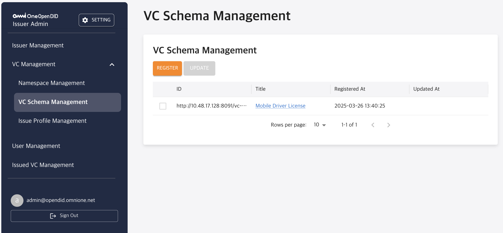

| 항목            | 설명                             |
|-----------------|----------------------------------|
| **ID**          | VC Schema의 고유 식별자입니다.   |
| **Title**       | 스키마의 제목입니다. 클릭 시 상세 화면으로 이동합니다.|
| **Registered At**| 최초 등록된 일시입니다.          |
| **Updated At**  | 마지막 수정된 일시입니다.         |

- `REGISTER` 버튼을 클릭하여 새 VC Schema를 등록할 수 있습니다.

### ▸ VC Schema 등록

새로운 VC Schema를 등록합니다.

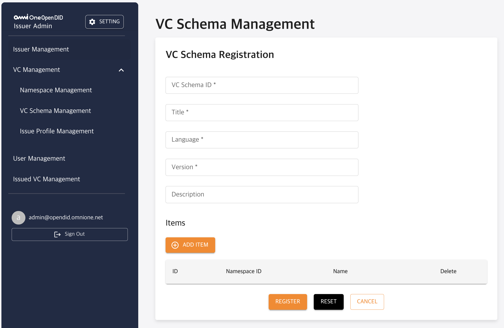

| 항목            | 설명                                        |
|-----------------|---------------------------------------------|
| **VC Schema ID**| VC Schema의 고유 식별자 또는 URL입니다.      |
| **Title**       | 스키마의 제목입니다.                         |
| **Language**    | VC Schema 언어(예: `ko`)입니다.                   |
| **Version**     | 스키마 버전입니다.                           |
| **Description** | VC Schema에 대한 설명입니다.                 |
| **Items**       | Schema에 포함될 네임스페이스 기반 항목 목록입니다.|

- 입력 완료 후 `REGISTER` 버튼으로 등록합니다.

---

### ▸ VC Schema 상세 정보

VC Schema 목록에서 제목을 클릭하면 스키마의 상세 정보를 확인할 수 있습니다.


| 항목                 | 설명                                                    |
|----------------------|---------------------------------------------------------|
| **VC Schema ID**     | VC Schema를 식별하는 고유한 URL 또는 ID입니다.          |
| **Title**            | VC Schema의 제목입니다.                                 |
| **Language**         | 스키마 설명 언어 설정입니다. (예: `ko`)                 |
| **Version**          | 스키마의 버전 정보입니다.                               |
| **Description**      | 스키마에 대한 상세 설명입니다.                          |
| **Credential Subject** | VC Schema에 포함된 Namespace 목록입니다. 항목을 클릭하면 해당 Namespace 상세 정보를 확인할 수 있습니다. |

- 상세 정보 화면에서 `GO TO EDIT` 버튼을 클릭하면 수정 화면으로 이동합니다.

---

### ▸ VC Schema 수정 (Update)

등록된 VC Schema의 내용을 수정할 수 있습니다.

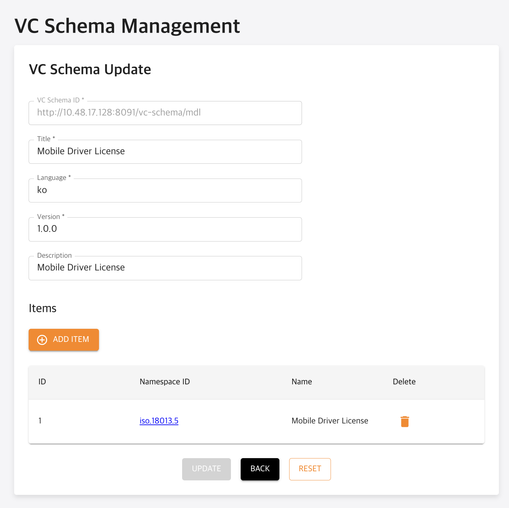

| 항목              | 설명                                                     |
|-------------------|----------------------------------------------------------|
| **VC Schema ID**  | 고유 식별자이므로 수정이 불가능합니다.                    |
| **Title**         | VC Schema의 제목을 수정할 수 있습니다.                    |
| **Language**      | 스키마 설명의 언어를 변경할 수 있습니다.                  |
| **Version**       | 스키마의 버전을 변경할 수 있습니다.                       |
| **Description**   | 스키마의 상세 설명을 수정할 수 있습니다.                  |
| **Items**         | Schema에 연결된 Namespace 항목을 추가 또는 삭제할 수 있습니다.<br> - `ADD ITEM` 버튼으로 항목을 추가하고, 휴지통 아이콘으로 삭제합니다. |

- 변경 사항 수정 후 `UPDATE` 버튼을 클릭하여 저장합니다.
- `RESET` 버튼은 폼을 초기 상태로 되돌리며, `BACK` 버튼으로 상세보기 화면으로 이동할 수 있습니다.

---

## 3.2.3. Issue Profile Management

Issue Profile Management는 VC 발급 시 사용할 프로파일(Issue Profile)을 정의하고 관리하는 메뉴입니다.  
Issue Profile은 VC Schema와 발급 정책 정보를 하나의 발급 플랜으로 구성하여, 실제 VC 발급 시 참조됩니다.

### ▸ Issue Profile 목록

등록된 Issue Profile 목록을 확인할 수 있습니다.

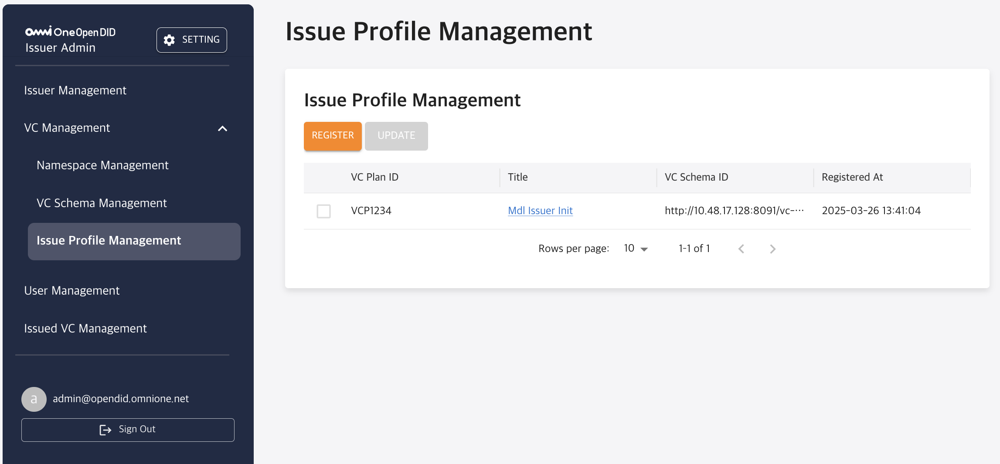

| 항목            | 설명                                             |
|-----------------|--------------------------------------------------|
| **VC Plan ID**  | Issue Profile을 식별하는 고유한 ID입니다. 클릭 시 상세 화면으로 이동합니다.|
| **Title**       | 프로파일의 제목입니다.                            |
| **VC Schema ID**| 연결된 VC Schema의 ID입니다. 클릭 시 Schema 상세 화면으로 이동합니다.|
| **Registered At**| Issue Profile이 등록된 일시입니다.               |

- `REGISTER` 버튼을 클릭하여 새로운 Issue Profile을 등록할 수 있습니다.

---

### ▸ Issue Profile 등록

Issue Profile 등록 화면에서 새로운 프로파일을 정의할 수 있습니다.

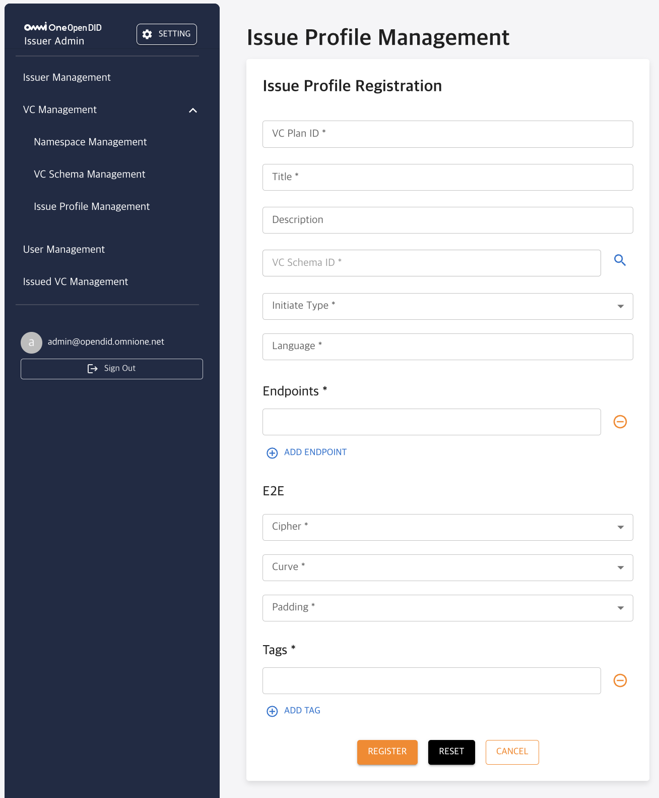

| 항목             | 설명                                                      |
|------------------|-----------------------------------------------------------|
| **VC Plan ID**   | 발급 프로파일의 고유 식별자입니다.                         |
| **Title**        | 발급 프로파일의 제목입니다.                               |
| **Description**  | 프로파일의 상세 설명입니다. (선택 사항)                    |
| **VC Schema ID** | 연동할 VC Schema의 ID입니다.                              |
| **Initiate Type**| VC 발급 요청의 시작 방식을 설정합니다.<br>(예: User Initiate, Issuer Initiate)|
| **Language**     | 프로파일의 언어 설정입니다. (예: `ko`)                    |
| **Endpoints**    | VC 발급 요청을 수신할 Endpoint 주소 목록입니다.             |
| **E2E**          | End-to-End 암호화 옵션을 설정합니다.<br>- Cipher, Curve, Padding 항목을 설정할 수 있습니다.|
| **Tags**         | 해당 프로파일을 구분하거나 검색 시 활용할 태그 정보입니다. |

- 입력 완료 후 `REGISTER` 버튼을 클릭하여 프로파일을 등록합니다.

---

### ▸ Issue Profile 상세 정보

목록에서 VC Plan ID를 클릭하면 상세 정보를 확인할 수 있습니다.

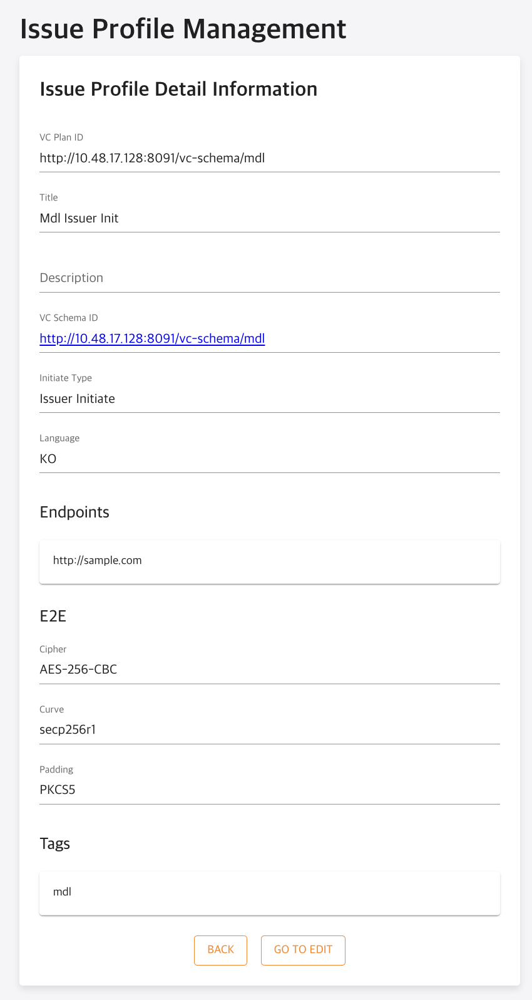

| 항목              | 설명                                          |
|-------------------|-----------------------------------------------|
| **VC Plan ID**    | 발급 프로파일의 고유 식별자입니다.            |
| **Title**         | 프로파일의 제목입니다.                        |
| **Description**   | 프로파일의 상세 설명입니다.                   |
| **VC Schema ID**  | 연결된 VC Schema의 ID입니다. 클릭 시 Schema 상세 화면으로 이동합니다.|
| **Initiate Type** | VC 발급 요청 시작 방식입니다.                 |
| **Language**      | 프로파일의 언어 설정입니다.                   |
| **Endpoints**     | VC 발급 요청을 수신할 Endpoint 주소 목록입니다. |
| **E2E(End-to-End Encryption)** | End-to-End 암호화 구성 정보입니다.<br>- Cipher, Curve, Padding 항목으로 구성됩니다.|
| **Tags**          | 프로파일에 설정된 태그 정보입니다.             |

- `GO TO EDIT` 버튼을 클릭하여 수정 화면으로 이동할 수 있습니다.

---

### ▸ Issue Profile 수정 (Update)

기존에 등록된 Issue Profile 정보를 수정합니다.

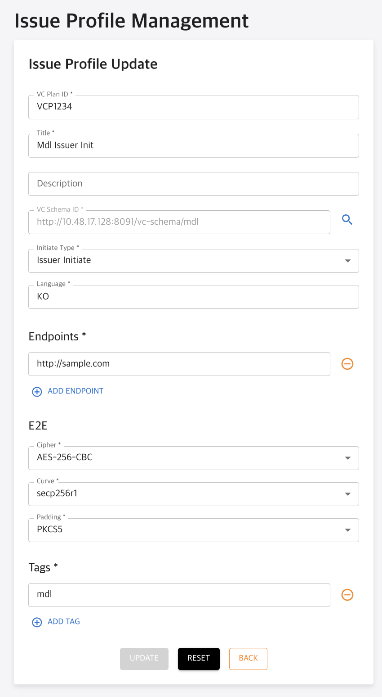

| 항목              | 설명                                           |
|-------------------|------------------------------------------------|
| **VC Plan ID**    | 발급 프로파일의 식별자로 수정할 수 없습니다.    |
| **Title**         | 프로파일의 제목입니다.                          |
| **Description**   | 프로파일의 상세 설명입니다.                     |
| **VC Schema ID**  | 이미 연동된 VC Schema는 변경할 수 없습니다.     |
| **Initiate Type** | VC 발급 요청 시작 방식을 수정할 수 있습니다.    |
| **Language**      | 프로파일의 언어 설정을 수정할 수 있습니다.      |
| **Endpoints**     | Endpoint 목록을 추가, 수정, 삭제할 수 있습니다.  |
| **E2E(End-to-End Encryption)** | 암호화 옵션(Cipher, Curve, Padding)을 수정할 수 있습니다.|
| **Tags**          | 프로파일의 태그를 추가, 수정, 삭제할 수 있습니다.|

- 변경 사항 수정 후 `UPDATE` 버튼을 클릭하여 저장합니다.
- `RESET` 버튼은 폼을 초기 상태로 되돌리며, `BACK` 버튼으로 상세보기 화면으로 이동할 수 있습니다.

---

### 3.3. User Management

User Management는 VC를 발급받을 사용자 정보를 관리하는 메뉴입니다.  
사용자는 DID 기반으로 등록되며, 하나의 VC Schema를 기준으로 사용자 VC 데이터를 저장합니다.

---

#### ▸ 사용자 목록

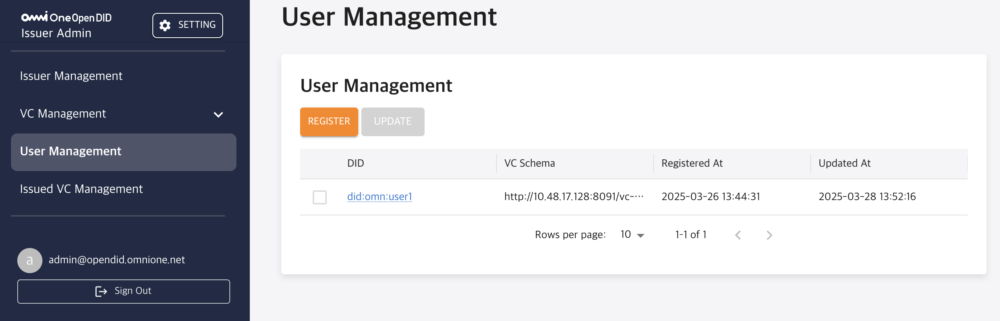

| 항목 | 설명 |
|------|------|
| **DID** | 사용자의 DID. 클릭 시 상세 정보 화면으로 이동합니다. |
| **VC Schema** | 사용자가 연결된 VC Schema의 ID |
| **Registered At** | 최초 등록 일시 |
| **Updated At** | 마지막 수정 일시 |

> `REGISTER` 버튼으로 새 사용자 등록 화면으로 이동하고,  
> 리스트에서 항목 선택 후 `UPDATE` 버튼으로 수정할 수 있습니다.

---

#### ▸ 사용자 등록 (Register)

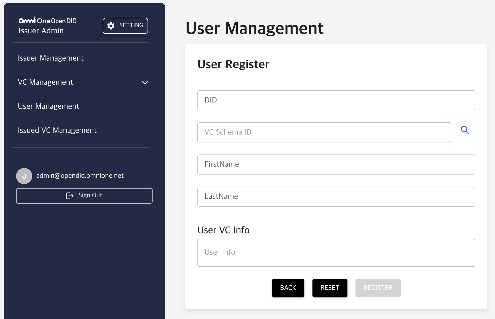

| 항목 | 설명 |
|------|------|
| **DID** | 사용자의 DID (고유 식별자) |
| **VC Schema ID** | 발급받을 VC의 스키마 ID (돋보기 아이콘 클릭으로 선택 가능) |
| **FirstName / LastName** | 사용자의 이름 정보. 내부적으로는 `PII`로 병합되어 저장됩니다. |
| **User VC Info** | VC 발급에 사용될 사용자 정보(JSON 형태로 입력) |

- `User VC Info`의 경우 앞서 등록했던 VC Schema에 포함된 Namespace를 기준으로 입력해야 합니다. 
- `{Namespace_ID}.{CLAIM_ID}`
  - 예시: {"iso.18013.5.name": "KimRaon", "iso.18013.5.birth_date": "2000-01-01"}

> 모든 필수 항목을 입력한 후 `REGISTER` 버튼을 클릭하면 사용자가 등록됩니다.  
> `RESET`은 입력값을 초기화하고, `BACK`은 목록 화면으로 돌아갑니다.

---

#### ▸ 사용자 상세 정보

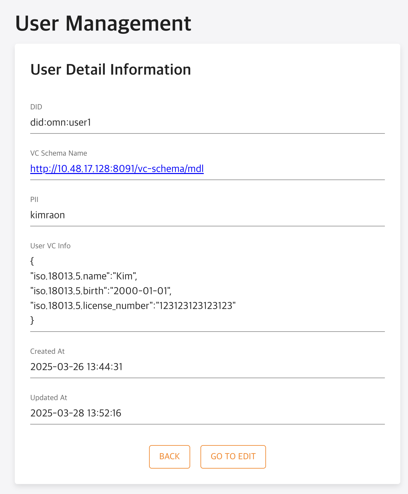

| 항목 | 설명 |
|------|------|
| **DID** | 사용자의 고유 식별자 (Decentralized Identifier) |
| **VC Schema Name** | 해당 사용자의 VC가 참조하는 VC Schema ID |
| **PII** | 사용자의 개인 식별 정보(Personal Identifiable Info) |
| **User VC Info** | 사용자에게 발급할 VC 데이터 (JSON 형태) |
| **Created At** | 사용자 등록 일시 |
| **Updated At** | 마지막 수정 일시 |

> `GO TO EDIT` 버튼으로 수정 화면으로 이동할 수 있습니다.

---

#### ▸ 사용자 정보 수정 (Update)


| 항목 | 설명 |
|------|------|
| **DID** | 사용자의 고유 식별자 |
| **PII** | 개인 식별 정보 |
| **VC Schema ID** | 연결된 VC Schema |
| **User VC Info** | 사용자에게 발급할 VC 데이터 (JSON 형태로 입력/수정 가능) |

> 수정이 끝나면 `UPDATE` 버튼을 클릭하여 저장할 수 있습니다.  
> `RESET`은 입력한 내용을 초기 상태로 되돌리며, `BACK`은 상세 화면으로 돌아갑니다.

### 3.4. Issued VC Management

발급된 VC를 조회하고 상태를 확인할 수 있는 기능입니다.

#### ▸ VC 목록

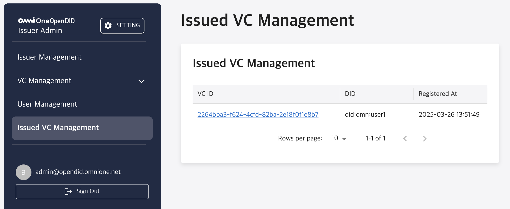

| 항목 | 설명 |
|------|------|
| **VC ID** | VC 고유 식별자 (상세로 이동) |
| **DID** | 발급 대상 사용자 DID |
| **Registered At** | 발급 일시 |

#### ▸ VC 상세 정보

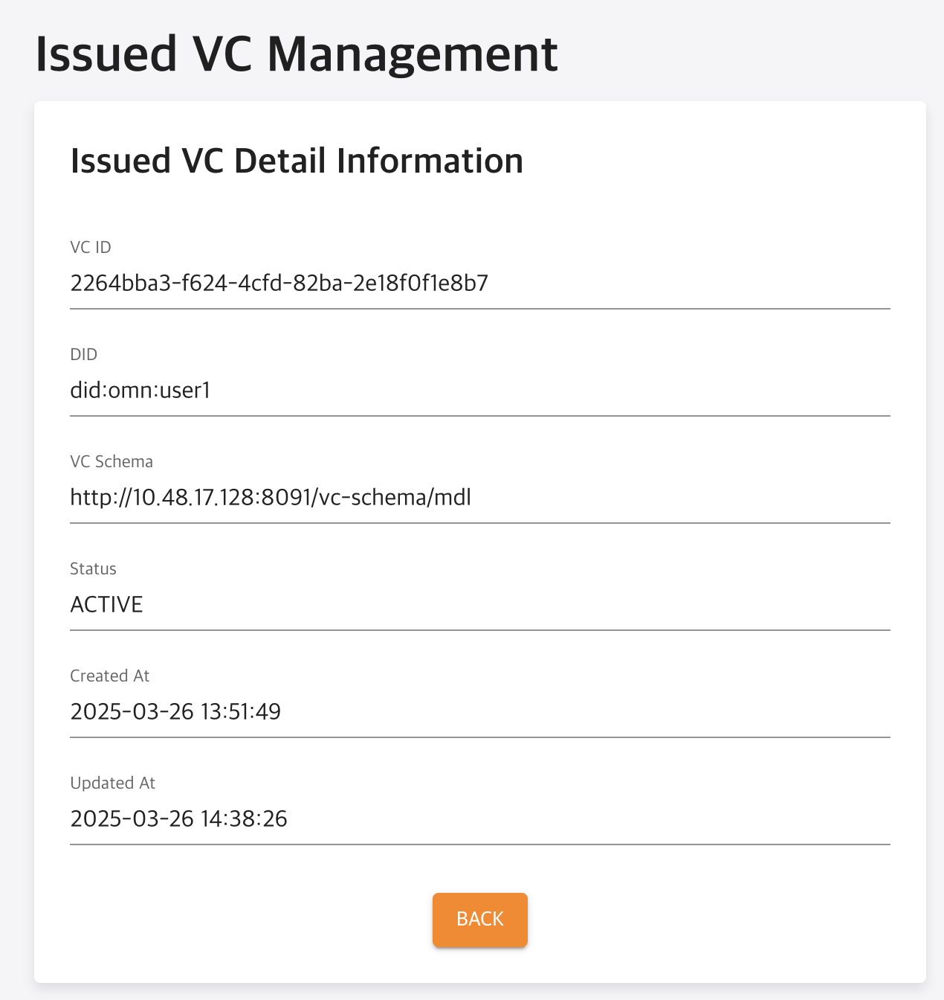

| 항목 | 설명 |
|------|------|
| **VC ID** | 고유 식별자 |
| **DID** | 사용자 DID |
| **VC Schema** | 발급한 VC 스키마 |
| **Status** | VC 상태 (`ACTIVE`, `REVOKE` 등) |
| **Created At / Updated At** | 생성 및 수정 시각 |

> 현재는 열람만 가능하며, 향후 상태 변경 등의 기능이 추가될 수 있습니다.

[Open DID Installation Guide]: https://github.com/OmniOneID/did-release/blob/develop/unrelease-V1.0.1.0/OepnDID_Installation_Guide-V1.0.1.0_ko.md
